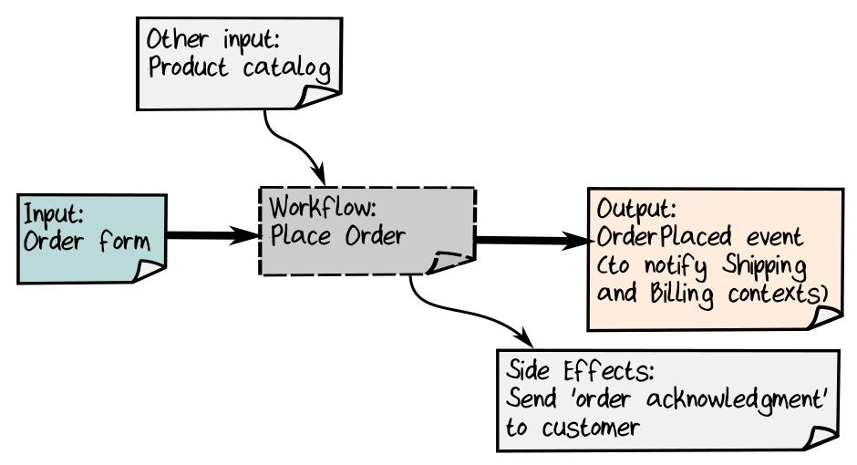

# DDDFunctional

*Materials from book - "Domain Modeling Made Functional" by Scott Wlaschin*

# Chapter 1. Introducing Domain-Driven Design

## The Importance of a Shared Model. (Преимущества общей модели)

<table>
<tr>
<td>


</td>
<td>


</td>
<td>


</td>
</table>

Преимущества общей модели (третий рисунок):

* *Faster time to market*. When the developer and the codebase share the
same model as the person who has the problem, the team is more likely
to develop an appropriate solution quickly.

* *More business value*. A solution that is accurately aligned with the problem
means happier customers and less chance of going offtrack.

* *Less waste*. Clearer requirements means less time wasted in misunderstanding
and rework. Furthermore, this clarity often reveals which components are high
value so that more development effort can be focused on them and less on the
low-value components.

* *Easier maintenance and evolution*. When the model expressed by the code
closely matches the domain expert’s own model, making changes to the
code is easier and less error-prone. Furthermore, new team members are
able to come up to speed faster.

Методические рекомендации по созданию shared model:

* Focus on business events and workflows rather than data structures.

* Partition the problem domain into smaller subdomains.

* Create a model of each subdomain in the solution.

* Develop a common language (known as the "Ubiquitous Language") that
is shared between everyone involved in the project and is used everywhere
in the code.

## Шаг 1. Understanding the Domain Through Business Events

Часто началом работы/запуска какого-либо процесса является:

* *внешний триггер* (a piece of mail arriving or your phone ringing)
* *time-based триггер* (you do something every day at 10 a.m.)
* *наблюдение* (there are no more orders in the inbox to process, so do something else)

>We call these things **Domain Events**.

* Domain Events are the starting point for almost all of the business processes we want to model.

For example, "new order form received" is a Domain Event that will kick off the
order-taking process.

* Domain Events are always written in the past tense (прошедшее время) - something happened.

### Шаг 1.1 Using Event Storming to Discover the Domain

Есть несколько способов discover the domain - один из них *Event Storming*.

Основные положения Event Storming:

* Bring together a variety of people (who understand different parts of the domain).
Собираются все, кто хоть что-то может спросить/сказать по поводу проекта.

* Проводится в помещении, где есть большая доска/стена, на которую можно лепить стикеры и/или
рисовать.

* Одни записывают деловые события на стикеры и размещают их на стене. Другие могут ответить,
разместив заметки с кратким описанием бизнес-процессов, которые запускаются этими событиями.
Эти рабочие процессы, в свою очередь, часто приводят к созданию других бизнес-событий.

* Заметки организованы в виде временной шкалы - распололагаются слева направо.

* Если вопросы не имеют четкого ответа, то они помещаются на доску/стену. Они
  служат триггерами для последующих обсуждений.

### Пример. Discovering the Domain: An Order-Taking System

Первый шаг: Focus on business events - "накидывание" Domain Events.
Получается множество событий наподобие:

* Order form received
* Order placed
* Order shipped
* Order change requested
* Order cancellation requested
* Return requested
* Quote form received
* Quote provided
* New customer request received
* New customer registered

И как оно может выглядеть на доске/стене:


`Place order` и `Ship order` это бизнес-процессы, мы начинаем понимать, как свъобытия
объединяются в более крупные рабочие процессы.

Выгоды от использования Event Storming:

* *A shared model of the business*
  * Участники участвуют в разработке общего понимания бизнес-процессов.
  * Все наглядно видят одно и тоже.
  * Многие могут уточнить детали взаимодействия, понимания и т.д.

* *Awareness of all the teams (осведомленность всех команд)*
  * Более полное взаимодействие между разными командами.
  * Может быть обнаружено, что другим командам тоже нужны результаты работы/процессов.

* *Finding gaps (пробелы/недочеты) in the requirements*
  * Требования в начале обсуждения могут быть нечеткими.
  * Наглядность может показать какие-то недочеты в требованиях.
  * Если вопрос не имеет четкого ответа, то он сам должен быть помещен на доску/стену. Он
  послужит триггером для дальнейших обсуждений.
  * Споры или разногласия это проблема, а как возможность улучшения и уточнения бизнес-процессов.

* *Connections between teams*
  * События могут быть сгруппированы по временной шкале (timeline).
  * Часто такие группировки показывают соединения - team's output is another team's input.


* *Awareness of reporting requirements*
  * Отчетность (reporting) всегда является частью предметной области.
  * Отчеты и другие доступные только для чтения модели (например, модели представления для
  пользовательского интерфейса) включаются в сеанс анализа событий.

### Шаг 1.2. Expanding (расширение) the Events to the Edges

Рекомендуется проследить цепочку событий как можно дальше, до границ системы.

* Происходят ли какие-либо события перед самым крайним левым событием?

* Какие события происходят после завершения самого крайнего правого события?

```text
Пример:
Мы: "Какое событие происходит перед начальным событием "Order received"?

Ответ: "We open the mail every morning, and the customers send in order forms
on paper, which we open up and classify as orders or quotes."

Мы: "So it looks like we need a "Mail received" event as well".

Мы: "Are there any possible events after you ship the order to the customer?”

Ответ: "If the order is "Signed for delivery" we'll get a notification from the
courier service. So let me add a "Shipment received by customer" event."
```


>### Workflows, Scenarios, and Use Cases
>
>* A **scenario** describes a goal that a customer (or other user) wants to achieve,
>such as placing an order. It is similar to a "story" in agile development.
>* A **use case** is a more detailed version of a scenario, which describes in general terms
>the user interactions and other steps that the user needs to take to accomplish
>a goal. Both scenario and use case are user-centric concepts, focused on how
>interactions appear from the user's point of view.
>* A **business process** describes a goal that the business (rather than an individual
>user) wants to achieve. It's similar to a scenario but has a business-centric focus
>rather than a user-centric focus.
>* A **workflow** is a detailed description of part of a business process. That is, it lists
>the exact steps that an employee (or software component) needs to do to
>accomplish a business goal or subgoal. We’ll limit a workflow to what a single
>person or team can do, so that when a business process is spread over multiple
>teams (as the ordering process is), we can divide the overall business process
>into a series of smaller workflows, which are then coordinated in some way.

### Шаг 1.3. Documenting Commands

После помещения всех Domain Events на доску/стену необходимо задать вопрос:
"What made these Domain Events happen? (Что было причной появления этих Domain Events?)"

>We call these requests **commands** in DDD terminology.

* Commands are always written in the imperative (повелительное наклонение, неопределенная форма
глагола): "Do this for me."

* Не все команды всегда успешно выполняются (но это рассматривается позже, вначале интересно
успешное выполнение команды).

* Если команда успешно выполнена, она запускает workflow, который создает
соответствующий Domain Events.

```text
Примеры:

1) If the command was "Make X happen" then, if the workflow made X happen,
the corresponding Domain Event would be "X happened."
2) If the command was "Send an order form to Widgets Inc" then, if the workflow sent the order,
the corresponding Domain Event would be "Order form sent."
3) Command: "Place an order"; Domain Event: "Order placed."
4) Command: "Send a shipment to customer ABC"; Domain Event: "Shipment sent."
```

Итого, цепочка такая:


Применительно к сценарию Order-taking process:


## Шаг 2. Partitioning the Domain into Subdomains

После шага 1 есть список команд и событий. Но общая картина пока что хаотична.

Следующий шаг: Partition the problem domain into smaller subdomains.

В примере весь "order-taking process" можно разделить: the order taking, the shipping, the billing,
and so on.

В разделении подобного рода может помочь физическое разделение бизнеса по отделам: отдел продаж,
отдел доставки и т.д. Каждый из этих отделов можно рассматривать как domain.

>**"Domain"** - an area of coherent knowledge (область логически связанных знаний).
>
>Альтернативное определение: **"domain"** is just that which a "domain expert" is
>expert in.

Внути домена могут быть области - subdomains.

>**Subdomains** - a smaller part of a larger domain that has its own specialized knowledge.

Пример subdomain: "web programming" это subdomain of "general programming." И "JavaScript
programming" is a subdomain of web programming.

Внизу, на картинке слева можно увидеть пример programming-related domains.

Домены могут иметь области пересечения. В реальности границы доменов могут быть размытыми,
нечеткими. В наших моделях необходимо выделить subdomains с более четкими границами.

На картинке справа приведен domain-partitioning approach к order-taking process:

<table>
<tr>
<td>


</td>
<td>


</td>
</table>

Здесь domains немного перескаются. An order-taker (принимаюзий заказы) должен немного знать
о том как работают отделы billing и shipping. Остальные отделы также должны хоть что-то знать
о своих соседях для взаимодействия.

## Шаг 3. Creating a Solution Using Bounded Contexts. (Создание решения с использованием ограниченных контекстов)

Расмматриваемый домен может содержать много информации. Для решения определенной проблемы бизнеса
необходимо выделить только ту информацию, которая требуется. Все остальное не имеет значения.

Необходимо провести различие между "problem space" ("пространством проблем") и
"solution space" ("пространством решений").

Чтобы построить решение надо создать *модель* проблемной области, извлекая только
те аспекты предметной области, которые имеют отношение к делу:


>В solution space видно что domains and subdomains в problem space отображаются на то,
>что в терминах DDD называется **bounded contexts** (ограниченные контексты).

Каждый bounded context это мини модель domain со своими правами.

Почему *context*? Каждый контекст содержит определенные знания. В пределах контекста есть
общий язык и логически-связный дизайн. Но вне контекста информация, взятая из него, может быть
искажена или непригодна к использованию.

Why *bounded* (ограниченный)? В реальном мире домены имеют нечеткие границы и содержат много
информации. Domain model никогда не будет такой богатой, как в реальном мире будет иметь более
четкие границы.

Domain в problem space не всегда имеет однозначную связь с контекстом в solution space.
Иногда domain разбивается на несколько bounded contexts (ограниченных контекстов).
Или несколько domains в problem space моделируется только одним bounded context в
solution space.

Последнее часто встречается, когда необходимо интегрироваться с legacy.

При разделении домена, важно, чтобы каждый bounded context нес четкую ответственность.
Т.к. при реализации модели, каждый ограниченный контекст четко соответствовует какому-то
программному компоненту. Компонентом может быть:

* Отдельная сборка DLL
* Автономный сервис
* Простой namespace (пространство имен)

### Getting the Contexts Right. (Правильное понимание/определение контекстов)

Наибольшая сложность в domain-driven design это правильное определение context boundaries.

Рекомендации:

* *Listen to the domain experts* (слушайте доменных экспертов).

* *Pay attention to existing team and department boundaries* (обратите внимание на существующие
границы команд и отделов). Эти границы могут помочь при выделении domains and subdomains.
Но это может не всегда работать.

* *Don't forget the "bounded" part of a bounded context* (не забывайте о "ограниченной" части
ограниченного контекста). Необходимо следить за изменениями границ при изменениях требований и
условий. Границы должны быть четкими и по возможности неизменяемыми.

* *Design for autonomy* (ориентации при проектировании на автономность). Всегда лучше иметь
независимый и автономный bounded contexts, который можно разрабатывать независимо от остальных.

* *Design for friction-free business workflows* (проектирование с учетом наименьших конфликтов
между различными бизнес-процессами). Если бизнес-процесс взаимодействует с несколькими bounded
contexts и часто блокируется или задерживается ими, то стоит переделать эти contexts.
Отдавать приоритет простоте бизнес-процесса над красотой дизайна.

* *No design is static*. Ни один из дизайнов не является неизменным: все они меняются при
изменениях в бизнес требований.

### Шаг 3.2. Creating Context Maps. (Создание карт контекста)

После определения contexts нужно рассмотреть взаимодействия между ними.
Надо создать общую картину взаимодействий не вдаваясь в детали дизайна.

>В DDD такие диаграммы называются **Context maps** (контекстные карты/карты контекста).

Пример: карта маршрута для путешествий. Она не показывает всех деталей, она фокусируется только
на основных маршрутах. Например, вот набросок карты маршрута авиакомпании:


По данной карте можно узнать, как перемещаться между городами. Если необходимо что-то другое,
например поездка в окрестностях New York, то нужна другая карта.

Context map показывает несколько bounded contexts и их взаимодействия. Цель - не отобразить
все детали, но показать всю систему в целом.

Пример context map для order-taking system:


* При создании context map нас не интересует внутренняя структура shipping context. Интересует
только то, что shipping context получает данные от order-taking context.
Мы неявно говорим, что shipping context находится *downstream* (нисходящий информационный поток),
а order-taking context в *upstream*.

* Два этих контекста должны будут согласовать общий формат для обмена сообщениями.

  * Как правило, upstream задает формат обмена.

  * Иногда downstream является негибким (legacy system) и либо восходящий контекст должен
  адаптироваться, либо используется вводится translator component (посредник-преобразователь).

* В сложных проектах создается серия context maps, каждая из которых описывает определенную
подсистему.

### Шаг 3.3. Focusing on the Most Important Bounded Contexts. (Фокусирование на наиболее важных ограниченных контекстах)

На данный момент у нас есть несколько bounded contexts. При дальншей работе над domain их может
стать больше. Но все ли они одинаково важны? С чего начать разработку?

Как правило наиболее важны domains, которые обеспечивают бизнес-преимущество. Т.е те,
которые приносят деньги. Другие домены также могут требоваться, но они не являются ключевыми.

>Домены, которые обеспечивают бизнес-преимущество (приносят деньги) называются **core domains**
>(основные домены).
>
>Остальные домены называются **supportive domains** (вспомогательные домены).
>Если они неуникальны для бизнеса, то они называются **generic domains** (общие домены).

Для рассматриваемого примера:

* order-taking и shipping domains являются core (основные) domains, т.к. их бизнес-преимуществом
является превосходное обслуживание клиентов.

* billing domain будет рассматривается как supportive (вспомогательный) domain.

* delivery of the shipments рассматривается как generic (общий) domain. - Можно передать на
outsource.

В реальности может быть все не так просто. Иногда core domain является не тот, что ожидался.
Бизнес электронной коммерции может обнаружить, что наличие товаров на
складе и готовность к отправке имеют решающее значение для удовлетворенности клиентов.
В этом случае inventory management может стать core domain, столь же важной для
успеха бизнеса, как и простой в использовании веб-сайт.

Иногда нет единого мнения о том, что является самой важной областью; каждый отдел может считать,
что его область является наиболее важной. А иногда core domain - это просто чтобы все работало.

Однако во всех случаях важно расставлять приоритеты, и не пытаться реализовать все bounded contexts
одновременно - это часто приводит к неудаче. Вместо этого надо сосредоточиться на bounded contexts,
которые добавляют наибольшую ценность.

## Creating a Ubiquitous Language. (Создание общего языка)

Разработчик и доменный эксперт должны использовать одну и ту же модель.

Это значит, что если доменный эксперт называет что-то `"order"`, то и разработчик должен
использовать в своей работе что-то под названием `Order`, которое ведет себя похожим образом.

Разработчику не следует использовать термины, которые не знакомы доменному эксперту:

* `OrderFactory`
* `OrderManager`
* `OrderHelper`

>Набор понятий и словарного запаса, который является общим для всех членов команды,
>называется **Ubiquitous Language** (вездесущим языком).

Этот язык должен во всех областях проекта:

* в требованиях
* в дизайне
* в исходном коде (самое главное).

Ubiquitous Language постоянно развивается и меняется вместе с дизайином и бизнесом.

В каждом контексте будет свой "диалект" Ubiquitous Language: одно и то же слово может означать
разные вещи. Например, "Customer" или "Product" в различных контекстах могут заметно отличаться.

## Summarizing the Concepts of Domain-Driven Design

* **Domain** (домен/предметная область) это область знаний, связанная (ассоциирующаяся) с
проблемой, которую пытаемся решить или просто, в которой "domain expert" является экспертом.

* **Domain Model** (модель домена/предметной области) это набор упрощений, представляющих те
аспекты domain (домена/предметной области) которые относятся к конкретной проблеме.
Domain model это часть solution space (пространства решений), тогда как domain - это часть
problem space (пространства проблем).

* **Ubiquitous Language** это набор понятий и словарного запаса, которые соответствуют domain.
Это язык, общий для команды и исходного кода.

* **Bounded context** (ограниченный контекст) это подсистема в solution space (пространстве решений)
с четкими границами , которые четко отделяют ее от друших подсистем. A bounded context
часто соответствует subdomain в the problem space (пространтве проблем). A bounded context
также имеет свой набор понятий и словарь, свой диалект в Ubiquitous Language.

* **Context Map** (карта контекста) это высокоуровневая диаграмма, показывающая bounded contexts
и взаимодействия между ними.

* **Domain Event** (доменное событие/событие предметной области) - запись о чем-то, что произошло
в системе. Обычно описывается в прошедшем времени. Событие часто является триггером для
других действий.

* **Command** - это запрос на выполнение какого-либо действия/процесса, который инициируется
человеком или другим событием. Если дествие/процесс завершается успешно, состояние системы
изменяется и записывается одно или несколько Domain Events (событий домена).

## Wrapping Up. (Подведение итогов)

Важносто создать общую модель предметной области и решения. Модель, одинаковую для команды
разработчиков и экспертов предметной области.

Четыре принципа, которые помогут сделать это:

* Focus on events and processes rather than data.
* Partition the problem domain into smaller subdomains.
* Create a model of each subdomain in the solution.
* Develop an "everywhere language" that can be shared between everyone involved in the project.

### Events and Processes

The event-storming session quickly revealed all the major Domain Events in the domain.

### Subdomains and Bounded Contexts

We have discovered three subdomains so far: "Order Taking", "Shipping" and "Billing".

We then defined three bounded contexts to correspond with these subdomains
and created a context map that shows how these three contexts interact.

Which one is the core domain that we should focus on?

### The Ubiquitous Language

We have terms like "order form", "quote" and "order".

It would be a good idea to create a living document or wiki page that lists these terms
and their definitions.

# Chapter 2. Understanding the Domain

## Interview with a Domain Expert

Начинается более подробное выяснение деталей о каждом из domain. Это может быть серия коротких
совещаний с domain expert'ом(ами).

Здесь важно:

* Отбросить все свои предположения и домыслы (могут быть неверными).
* Уметь слушать.
* Исследовать область домена, задавая вопросы доменному эксперту.

### Understanding the Non-functional Requirements

В примере рассматривается выяснение деталей по the order-placing process.

У domain expert выяснено:

1. Заказчик знает, что он хочет заказать. Для заказа используется простая форма.
2. Заказчик вводит коды продуктов и их количество.
3. Наименований продуктов может быть несколько сотен, поэтому коды вводятся заказчиком "напрямую",
без выбора из страниц.

Нефункциональные требования:

1. Порядка 200 заказов каждый день. (Нет большой нагрузки).
2. Нагрузка постоянна в течение всего года. (Нет пиковых нагрузок).
3. Заказчики не новички. (Дизайн/бизнес-процесс для чайников отличается от дизайна/бизнес-процесса
для экспертов).
4. Скорость для заказчика не важна. Подтверждение ожидается в течение дня.
5. Важна надежность: обратная связь, аудит на каждом из этапов обработки заказа.

### Understanding the Rest of the Workflow

Функциональные требования:

1.1 После получения формы коды товаров на форме сверяются со справочником product catalog.

1.2 Product catalog обновляется раз в месяц.

1.3 Открытие **новой детали** в системе: Product catalog - это плюс еще один bounded context.
В будущем по нему необходимо выяснить более подробные сведения.

2.1 После проверки кодов товаров считается суммарная стоимость всех products.

2.2 Сумма  записывается в поле "Total".

3.1 Order сканируется и делаются 2 копии.

3.2 Оригинал остается в департаменте.

3.3 Одна копия идет в shipping department (доставка), другая - в billing department (выставление
счетов).

3.4 Скан order отправляется заказчику, чтобы он увидел окончательные цены. Это называется
"order acknoledgment" (подтверждение заказа).

4.1 У формы есть два флажка для заполнения "Quote" или "Order".

4.2 Для "Quote" просто считаются цены на продукты и форма отправляется обратно заказчику.
Никакие копии не отправляются в другие отделы shipping и billing.

### Thinking About Inputs and Outputs

Итак **Input** (вход) - это **order form** (форма заказа).

>**Output** для workflow должен быть всегда events (события), которые генерируются.
>Events являются триггерами действий, которые запускаются в других bounded contexts.

В нашем случае **Output** - это "**Order Placed**" (заказ размещен). Это событие посылается
в shipping и billing департаменты.



## Fighting the Impulse to Do Database-Driven Design

# Links

* [EventStorming book by Alberto Brandolini](http://eventstorming.com)

Alberto Brandolini - создатель метода "Event Storming".
