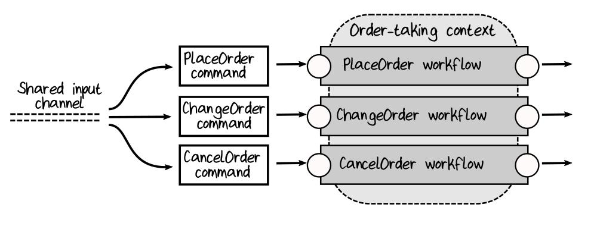
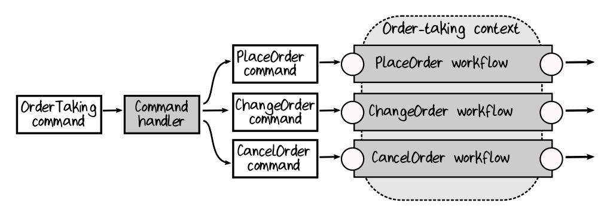

# Chapter 4. Understanding Types

## Understanding Functions

### Type Signatures

Описание `apple -> banana` называется *type signature* (подпись типа). Также известна как
*function signature*.

Еще примеры:

```fsharp
let add1 x = x + 1      // signature: int -> int
let add x y = x + y     // signature: int -> int -> int
```

Пример функции в F#. В ней есть подфункция.

```fsharp
// int -> int
let squarePlusOne:
    let square = x * x
    square + 1
```

### Functions with Generic Types

Функция работает с *любым* типом данных:

```fsharp
// 'a -> 'a -> bool
let areEqual x y =
    (x = y)
```

Для сравнения, эта же фукция в C#:

```csharp
static bool AreEqual<T>(T x, T y)
{
    return (x == y);
}
```

## Types and Functions

*Type* (тип) - это имя, данное множеству возможных значений, которые могут быть использованы
в качестве входов или выходов функции.

Типами могут быть любые сущности реальные или виртуальные: примитивные типы, объекты, сами функции.

Сигнатуры функций с input/output различных типов:

```fsharp
int16 -> someOutputType
someInputType -> string
Person -> someOutputType
someInputType -> Fruit
someInputType -> (Fruit -> Fruit)
```

>### Jargon Alert: "Values" vs. "Objects" vs. "Variables"
>
>In a functional programming language, most things are called "*values*." In an object-
>oriented language, most things are called "*objects*". So what is the difference between
>a "value" and an "object"?
>
>A *value* is just a member of a type, something that can be used as an input or an
>output. For example, `1` is a value of type `int` , `"abc"` is a value of type `string`,
>and so on.
>
>*Functions can be values too*. If we define a simple function such as `let add1 x = x + 1`,
>then `add1` is a (function) value of type `int->int`.
>
>*Values are immutable* (which is why they are not called "variables").
>And *values do not have any behavior attached to them*, they are just *data*.
>
>In contrast, an *object is an encapsulation of a data structure and its associated behavior (methods)*.
>In general, *objects are expected to have state* (that is, be *mutable*),
>and *all operations that change the internal state must be provided by the object itself*
>(via "dot" notation).
>
>So in the world of functional programming (where objects don’t exist), you should
>use the term "value" rather than "variable" or "object".

## Composition of Types

В ФП композиция используется для создания новых функций из меньших функций и новых типов из более
мелких типов.

### "AND" Types

Тип record:

```fsharp
type FruitSalad = {
    Apple: AppleVariety
    Banana: BananaVariety
    Cherries: CherryVariety
}
```

### "OR" Types

Choice type - *discriminated union*:

```fsharp
type FruitSnack =
    | Apple of AppleVariety
    | Banana of BananaVariety
    | Cherries of CherryVariety

type AppleVariety =
    | GoldenDelecious
    | GrannySmith
    | Fuji

type BananaVariety =
    | Cavedish
    | GrosMichel
    | Manzano

type CherryVariety =
    | Montmorency
    | Bing
```

>### Jargon Alert: "Product Types" and "Sum Types"
>
>The types that are built using AND are called **product types**.
>
>The types that are built using OR are called **sum types** or **tagged unions** or, in F#
>terminology, **discriminated unions**.

### Simple Types

Choice type могут выражаться только одним типом:

```fsharp
type ProductCode =
    | ProductCode of string
```

или (чаще используется):

```fsharp
type ProductCode = ProductCode of string
```

## Working with F# Types

Определение типа record:

```fsharp
type Person = { First: string; Last: string }
```

Определение value типа `Person`:

```fsharp
let aPerson = { First = "Alex"; Last = "Adams" }
```

Deconstruct:

```fsharp
let { First = first; Last = last } = aPerson
```

или так:

```fsharp
let first = aPerson.First
let last = aPerson.Last
```

Определение типа choice:

```fsharp
type OrderQuantity =
    | UnitQuantity of int
    | KilogramQuantity of decimal
```

Определение value (constructor)

```fsharp
let anOrderQtyInUnits = UnitQuantity 10
let anOrderQtyInKg = KilogramQuantity 2.5
```

Deconstruct:

```fsharp
let printQuantity aOrderQty =
    match aOrderQty with
    | UnionQuantity uQty -> printfn "%i units" uQty
    | KilogramQuantity kgQty -> printfn "%g kg" kgQty
```

Использование deconstuct:

```fsharp
printQuantity anOrderQtyInUnits     // "10 units"
printQuantity anOrderQtyInKg        // "2.5 kg"
```

## Building a Domain Model by Composing Types

Пример. Описание домена payments for an e-commerce site.

Документация данных.

```fsharp
type CheckNumber = CheckNumber of int
type CardNumber = CardNumber of string

type CardType =
    Visa | Mastercard

type CreditCardInfo = {
    CardType : CardType
    CardNumber : CardNumber
}

type PaymentMethod =
    | Cash
    | Check of CheckNumber
    | Card of CreditCardInfo

type PaymentAmount = PaymentAmount of decimal
type Currency = EUR | USD

type Payment = {
    Amount : PaymentAmount
    Currency : Currency
    Method : PaymentMethod
}
```

Документация функций.

```fsharp
type PayInvoice =
    UnpaidInvoice -> Payment -> PaidInvoice

type ConvertPaymentCurrency =
    Payment -> Currency -> Payment
```

## Modeling Optional Values, Errors, and Collections

* Optional or missing values
* Errors
* Functions that return no value
* Collections

### Modeling Optional Values

Для отсутствующего значения в F# используется тип `Option`:

```fsharp
type Option<'a> =
    | Some of 'a
    | None
```

Пример использования для описания типа `PersonalName`:

```fsharp
type PersonalName = {
    FirstName : string
    MiddleInitial : Option<string>      // optional
    LastName : string
}
```

Чаще всего записывают в такой форме:

```fsharp
type PersonalName = {
    FirstName : string
    MiddleInitial : string option       // optional
    LastName : string
}
```

### Modeling Errors

В F# предпочтительно документировать возможность ошибки путем использования типа `Result`:

```fsharp
type Result<'Success, 'Failure> =
    | Ok of 'Success
    | Error of 'Failure
```

Тип `Result` входит в стандартные библиотеки F# начиная с версии F# 4.1.

Пример использования:

```fsharp
type PayInvoice =
    UnpaidInvoice -> Payment -> Result<PaidInvoice, PaymentError>

type PaymentError =
    | CardTypeNotRecognized
    | PaymentRejected
    | PaymentProviderOffline
```

### Modeling No Value at All

Отсутствие выходного значения у функции в F#:

```fsharp
type SaveCustomer = Customer -> unit
```

Отсутствие входных значений у функции в F# (без параметров):

```fsharp
type NextRandom = unit -> int
```

Наличие `unit` в сигнатуре функции часто является признаком наличия у фукции side effect.

### Modeling Lists and Collections

Типы коллекций в F#:

* `list` - неизменяемая коллекция, определенного размера. Реализована в виде linked list
(связный список).
* `array` - изменяемая коллекция, определенного размера. Каждый элемент доступен по индексу.
* `ResizeArray` - массив изменяемого размера. Аналогичен по функциональности `List<T>` в C#.
* `seq` - lazy коллекция, каждый элемент возвращается по запросу. Аналогичен по функциональности
`IEnumerable<T>` в C#.
* `Map` (аналогичен `Dictionary`) и `Set`. Редко используются в domain model.

В domain model чаще всего используется `list`.

Пример использования:

```fsharp
type Order = {
    OrderId : OrderId
    Lines : OrderLine list      // a collection
}
```

Создание `list`, добавление элемента к существующему `list`:

```fsharp
let aList = [1; 2; 3]

let aNewList = 0 :: aList       // [0; 1; 2; 3]
```

Deconstruct `list`:

```fsharp
let printList1 aList =
    match aList with
    | [] -> printfn "list is empty"
    | [x] -> printfn "list has one element: %A" x
    | [x; y] -> printfn "list has two elements: %A and %A" x y
    | longerList -> printfn "list has more than two elements"
```

Match с использованием "cons" оператора:

```fsharp
let printList2 aList =
    match aList with
    | [] -> printfn "list is empty"
    | first :: rest -> printfn "list is not empty with the first element being: %A" first
```

## Organizing Types in Files and Projects

В F# порядок файлов важен. Файлы, расположенные выше, не могут ссылаться на файлы,
 расположенные ниже.

Файлы проекта могут быть расположены в подобном порядке:

```text
Common.Types.fs
Common.Functions.fs
OrderTaking.Types.fs
OrderTaking.Functions.fs
Shipping.Types.fs
Shipping.Functions.fs
```

В файле, порядок описаний типов и функций также важен:

```fsharp
module Payments =
    type CheckNumber = CheckNumber of int

    type PaymentMethod =
        | Cash
        | Check of CheckNumber      // определен выше
        | Card of ...

    type Payment = {
        Amount : ...
        Currency : ...
        Method : PaymentMethod     // определен выше
    }
```

Когда требуется писать код без ограничения "top down", то можно использовать `rec` (F# 4.1 и выше)
или `and`. Но лучше, когда дизайн "устаканится", писать в стиле "top down".

Пример использования `rec`:

```fsharp
module rec Payments =
    type Payment = {
        Amount : ...
        Currency : ...
        Method : PaymentMethod      // определен ниже
    }

type PaymentMethod =
    | Cash
    | Check of CheckNumber          // определен ниже
    | Card of ...

type CheckNumber = CheckNumber of int
```

Пример использования `and`:

```fsharp
type Payment = {
    Amount : ...
    Currency : ...
    Method : PaymentMethod          // определен ниже
}

and PaymentMethod =
    | Cash
    | Check of CheckNumber          // определен ниже
    | Card of ...

and CheckNumber = CheckNumber of int
```

# Chapter 5. Domain Modeling with Types

## Reviewing the Domain Model

Text-based документация domain model, сделанная ранее:

```text
context: Order-Taking

// --------------------
// Simple types
// --------------------

// Product Codes
data ProductCode = WidgetCode OR GizmoCode
data WidgetCode = string starting with "W" then 4 digits
data GizmoCode = string starting with "G" then 3 digits

// Order Quantity
data OrderQuantity = UnitQuantity OR KilogramQuantity
data UnitQuantity = integer between 1 and 1000
data KilogramQuantity = decimal between 0.05 and 100.0
```

```text
// --------------------
// Order life cycle
// --------------------

// ----- unvalidated state -----
data UnvalidatedOrder =
    UnvalidatedCustomerInfo
    AND UnvalidatedShippingAddress
    AND UnvalidatedBillingAddress
    AND list of UnvalidatedOrderLine

data UnvalidatedOrderLine =
    UnvalidatedProductCode
    AND UnvalidatedOrderQuantity

// ----- validated state -----
data ValidatedOrder =
    ValidatedCustomerInfo
    AND ValidatedShippingAddress
    AND ValidatedBillingAddress
    AND list of ValidatedOrderLine

data ValidatedOrderLine =
    ValidatedProductCode
    AND ValidatedOrderQuantity

// ----- prices state -----
data PricedOrder =
    ValidatedCustomerInfo
    AND ValidatedShippingAddress
    AND list of PricedOrderLine
    AND AmountOfBill

data PricedOrderLine =
    ValidatedOrderLine
    AND LinePrice

// ----- output events -----
data OrderAcknowledgmentSent =
    PricedOrder
    AND AcknowledgementLetter

data OrderPlaced = PricedOrder

data BillableOrderPlaced =
    OrderId
    AND BillingAddress
    AND AmountToBill
```

```text
// --------------------
// Workflows
// --------------------
workflow "Place Order" =
    input: UnvalidatedOrder
    output (on success):
        OrderAcknowledgmentSent
        AND OrderPlaced (to send to shipping)
        AND BillableOrderPlaced (to send to billing)
    output (on error):
        InvalidOrder
// etc
```

## Seeing Patterns in a Domain Model

Из текстового описания domain можно выделить повторяющиеся паттерны:

* *Simple values*. Примитивные типы: `string`, `integer` и т.п. Доменный эксперт не думает в
подобных терминах, а думает в терминах таких как `OrderId` и `ProductCode`.
* *Combinations of values with AND*. Группы связанных данных.
* *Choices with OR*. Выбор данных. `Order` или `Quote`, `UnitQuantity` или `KilogramQuantity`.
* *Workflows*. Бизнес-процессы. Имеют input и output.

## Modeling Simple Values

Синтаксис:

```text
type CustomerId = CustomerId of int
     ^type name   ^case label
```

Для нашего domain:

```fsharp
type WidgetCode = WidgetCode of string
type UnitQuantity = UnitQuantity of int
type KilogramQuantity = KilogramQuantity of decimal
```

### Working with Single Case Unions

```text
type CustomerId = CustomerId of int
                  ^this case name will be constructor function
```

Создание типа (использование конструктора):

```fsharp
let customerId = CustomerId 42
```

Два разных типа неэквивалентны:

```fsharp
type CustomerId = CustomerId of int
type OrderId = OrderId of int

let customerId = CustomerId 42
let orderId = OrderId 42

printfn "%b" (orderId = customerId)     // Ошибка компиляции
```

Деконструкция:

```fsharp
let (CustomerId innerValue) = customerId        // innerValue = 42
printfn "%i" innerValue                         // выведет "42"
```

Деконструкция в параметре определяемой функции:

```fsharp
// val processCustomerId: CustomerId -> unit
let processCustomerId (CustomerId innerValue) =
    printfn "innerValue is %i" innerValue
```

### Constrained Values

См. следующую главу 6.

### Avoiding Performance Issues with Simple Types

Такое "обертывание" несколько замедляет работу программ. Если необходимо ускориться, то можно:

1. Использовать type alias. Нет overhead, но теряется type-safety.

```fsharp
type UnitQuantity = int
```

2. Начиная с F# 4.1 можно использовать value type (a struct). Overhead есть, но есть оптимизация
по доступу в памяти.

```fsharp
[<Struct>]
type UnitQuantity = UnitQuantity of int
```

3. При работе с большими массивами, можно рассмотреть определение коллекции примитивных типов
как один тип. Это позволит эффективно работать с внутренними данными (например, перемножение матриц)
и сохранит type-safety.

```fsharp
type UnitQuantities = UnitQuantities of int[]
```

## Modeling Complex Data

### Modeling with Record Types

Используются для моделирования структур данных **AND**.

Такое text-based описание:

```text
data Order =
    CustomerInfo
    AND ShippingAddress
    AND BillingAddress
    AND list of OrderLines
    AND AmountToBill
```

В F# можно записать в виде record:

```fsharp
type Order = {
    CustomerInfo : CustomerInfo
    ShippingAddress : ShippingAddress
    OrderLines : OrderLine list
    AmountToBill : BillingAmount
}
```

### Modeling Unknown Types

Для этапов разработки, когда еще неизвестно внутреннее содержимое некоторых типов
можно этот момент явно указать при описании типа.

**Решение** - использование исключения. В F# это `exn`. Также рекомендуется задать alias, который потом
используется в коде:

```fsharp
type Undefined = exn
```

Использование alias:

```fsharp
type CustomerInfo = Undefined
type ShippingAddress = Undefined
type BillingAddress = Undefined
type OrderLine = Undefined
type BillingAmount = Undefined

type Order = {
    CustomerInfo : CustomerInfo
    ShippingAddress : ShippingAddress
    BillingAddress : BillingAddress
    OrderLines : OrderLine list
    AmountToBill : BillingAmount
}
```

Такой подход позволит описать domain и скомпилировать код. Но при написании функций, которые будут
работать с типами domain надо будет заменить `Undefined` на рабочий код.

### Modeling with Choice Types

Используются для моделирования структур данных **OR**.

Такое text-based описание:

```text
data ProductionCode =
    WidgetCode
    OR GizmoCode

data OrderQuantity =
    UnitQuantity
    OR KilogramQuantity
```

В F# можно записать в виде descriminated union:

```fsharp
type ProductCode =
    | Widget of WidgetCode
    | Gizmo of GizmoCode

type OrderQuantity =
    | Unit of UnitQuantity
    | Kilogram of KilogramQuantity
```

Где

```text
| Widget of WidgetCode
  ^tag      ^type
```

tag - наименование case

type - тип данных, который ассоциируется с tag

## Modeling Workflows with Functions

Описали все "nouns" (существительные) для domain, теперь надо описать "verbs"
(глаголы) - бизнес-процессы.

Бизнес-процессы описываются с помощью function types:

```fsharp
type ValidateOrder = UnvalidatedOrder -> ValidatedOrder
```

### Working with Complex Inputs and Outputs

#### Результат бизнес-процесса - несколько выходов (связь AND)

1. Надо создать тип record, объединяющий выходы.
2. Описать function type с общим типом в качестве выхода.

Например, результатом бизнес-процесса являются три события. Эти события объединяются в один тип:

```fsharp
type PlaceOrderEvents = {
    AcknowledgmentSent : AcknowledgmentSent
    OrderPlaced : OrderPlaced
    BillableOrderPlaced : BillableOrderPlaced
}
```

Function type, описывающий бизнес-процесс `Place Order`, будет выглядеть так:

```fsharp
type PlaceOrder = UnvalidatedOrder -> PlaceOrderEvents
```

#### Результат бизнес-процесса - один из нескольких выходов (связь OR)

1. Надо создать тип discriminated union (DU), объединяющий выходы.
2. Описать function type с общим типом в качестве выхода.

Пример, есть вот такое text-based описание бизнес-процесса:

```text
workflow "Categorize Inbound Mail" =
    input: Envelope contents
    output:
        QuoteForm (put on appropriate pile)
        OR OrderForm (put on appropriate pile)
        OR ...
```

Его описание в виде кода. Данные:

```fsharp
type EnvelopeContents = EnvelopeContents of string
type CategorizedMail =
    | Quote of QuoteForm
    | Order of OrderForm
    // etc
```

Действие:

```fsharp
type CategorizeInboundMail = EnvelopeContents -> CategorizedMail
```

#### У бизнес-процесса несколько входов. Требуется только один (связь OR)

Надо создать тип discriminated union (DU), объединяющий входы.

#### У бизнес-процесса несколько входов. Требуются все (связь AND)

Бизнес-процесс, например:

```text
"Calculate Prices" =
    input: OrderForm, ProductCatalog
    output: PricedOrder
```

Возможно два варианта реализации.

1. Самый простой. Передать каждый вход как отдельный параметр в функцию:

```fsharp
type CalculatePrices = OrderForm -> ProductCatalog -> PricedOrder
```

Используется если один из параметров это зависимость от другого сервиса.
Функциональный dependency injection.

2. Создать тип record, объединяющий входы. Иногда используются tuple.

```fsharp
type CalculatePriceInput = {
    OrderForm : OrderForm
    ProductCatalog : ProductCatalog
}
```

Function type будет выглядеть так:

```fsharp
type CalculatePrices = CalculatePricesInput -> PricedOrder
```

Используется, если входные параметры логически связаны друг с другом.

### Documenting Effects in the Function Signature

>В ФП используется термин **effects** - побочные эффекты, которые производит функция помимо
>выходных данных.

Функция не всегда может успешно завершиться и возвратить какое-либо значение. Ипользуется тип
`Result` для описания такого effect:

```fsharp
type ValidateOrder =
    UnvalidatedOrder -> Result<ValidatedOrder, ValidationError list>
```

Функция асинхронна и может завершиться с ошибкой:

```fsharp
type ValidateOrder =
    UnvalidatedOrder -> Async<Result<ValidatedOrder, ValidationError list>>
```

Такая сигнатура типа выглядит плохо читаемой, поэтому для нее можно ввести alias:

```fsharp
type ValidationResponse<'a> = Async<Result<'a, ValidationError list>>
```

Функция будет выглядеть так:

```fsharp
type ValidateOrder =
    UnvalidatedOrder -> ValidationResponse<ValidatedOrder>
```

## A Question of Identity: Value Objects

>В DDD объект с явным идентификатором называется **Entity**, без него - **Value Object**.

В большинстве случаев объекты данных без явной идентичности (идентификаторов) взаимозаменяемы,
т.е. являются Value Object'ами.

Например, адреса, имена, почтовые индексы - примеры Value Objects.

```fsharp
let widgetCode1 = WidgetCode "W1234"
let widgetCode2 = WidgetCode "W1234"
printfn "%b" (widgetCode1 = widgetCode2)    // prints "true"

let name1 = {FirstName="Alex"; LastName="Adams"}
let name2 = {FirstName="Alex"; LastName="Adams"}
printfn "%b" (name1 = name2)                // prints "true"

let address1 = {StreetAddress="123 Main St"; City="New York"; Zip="90001"}
let address2 = {StreetAddress="123 Main St"; City="New York"; Zip="90001"}
printfn "%b" (address1 = address2)          // prints "true"
```

### Implementing Equality for Value Objects

В F# по умолчанию все поля алгебраических типов структурно эквивалентны. Все такие типы в F#
можно рассматривать как Value Objects.

## A Question of Identity: Entities

Примеры Entity: orders, quotes, invoices, customer profiles, product sheets, ...

* Различие между Value Object и Enitity зависит от контекста.

* Enitity может содержать в себе один или несколько Value Object.

* При изменении Value Object, Entity, который его содержит остается прежним.

Пример: смартфон (Entity), у которого поменяли экран или батарею.

### Identifiers for Entities

Entity должен иметь стабильный идентификатор, не зависящий от изменений.

* Идентфикатором должен быть уникальный ключ, присущий определенному Entity.
* Под идентфикатор выделяется отдельное поле, типа "Order ID" или "Customer ID".

Пример:

```fsharp
type ContactId = ContactId of int

type Contact = {
    ContactId : ContactId
    PhoneNumner : ...
    EmailAddress : ...
}
```

Источники для идентификаторов:

* Реально существующий domain: бумажные orders, invoices, ...
* Сервис(ы), генерирующий UUIDs.
* Столбцы идентификаторов в БД.

### Adding Identifiers to Data Definitions

В случае типа record добавить идентификатор просто. С discriminated union не все так просто.
Есть два спопоба добавления поля id.

1. **Способ 1**. Идентификатор хранится "снаружи" Entity. Менее распространенный.


```fsharp
// Info for the unpaid case (without id)
type UnpaidInvoiceInfo = ...

// Info for the paid case (without id)
type PaidInvoiceInfo = ...

// Combined information (without id)
type InvoiceInfo =
    | Unpaid of UnpaidInvoiceInfo
    | Paid of PaidInvoiceInfo

// Id for invoice
type InvoiceId =

// Top level invoice type
type Invoice = {
    InvoiceId : InvoiceId           // "outside" the two child cases
    InvoiceInfo : InvoiceInfo
}
```

Недостаток: сложно работать с данными для одного case, данные разделяются между несколькими
компонентами.

1. **Способ 2**. Идентификатор хранится "внутри" Entity. Наиболее популярный способ.

```fsharp
type UnpaidInvoice = {
    InvoiceId : InvoiceId       // id stored "inside"
    // and other info for the unpaid case
}

type PaidInvoice = {
    InvoiceId : InvoiceId       // id stored "inside"
    // and other info for the paid case
}

// top level invoice type
type Invoice =
    | Unpaid of UnpaidInvoice
    | Paid of PaidInvoice
```

Преимущество: все данные доступны в одном месте. Например для pattern matching:

```fsharp
let invoice = Paid { InvoiceId = ... }

match invoice with
    | Unpaid unpaidInvoice -> printfn "The unpaid invoiceId is %A" unpaidInvoice.InvoiceId
    | Paid paidInvoice -> printfn "The paid invoiceId is %A" paidInvoice.InvoiceId
```

### Implementing Equality for Entities

Для Entity эквивалентность определяется по одному полю - полю идентификатора. Т.к. в F#
по умолчанию при эквивалентности рассматриваются все поля типа, то необходимо
переопределить Equality.

**1 Способ**. Надо переопределить следующее:

* Override метод `Equals`.
* Override метод `GetHashCode`.
* Добавить атрибуты `CustomEquality` и `NoComparison` к типу, чтобы сообщить компилятору
о переопределении Equality.

Что получается в итоге:

```fsharp
[<CustomEquality; NoComparison>]
type Contact = {
    ContactId : ContactId
    PhoneNumber : PhoneNumber
    EmailAddress : EmailAddress
    }
    with
    override this.Equals(obj) =
        match obj with
        | :? Contact as c -> this.ContactId = c.ContactId
        | _ -> false
    override this.GetHashCode() =
        hash this.ContactId
```

После такого переопределения Equality можно сравнивать между собой `Contact`s:

```fsharp
// Определение двух Contact
let contactId = ContactId 1

let contact1 = {
    ContactId = contactId
    PhoneNumber = PhoneNumber "123-456-7890"
    EmailAddress = EmailAddress "bob@example.com"
}

let contact2 = {
    ContactId = contactId
    PhoneNumber = PhoneNumber "123-456-7890"
    EmailAddress = EmailAddress "robert@example.com"
}

// Сравнение
printfn "%b" (contact1 = contact2)      // true
```

Это распространенный подход в ООП, но такой подход может приводить к ошибкам:

* При изменении Equality потом можно получить результаты отличные от ожидаемых
(забыли о переопределении и рассчитывали на поведение по умолчанию).
* Забыли переопределить Equality.

**2 Способ**. Более простой и предпочтительный поход:

* Добавить атрибуты `NoEquality` и `NoComparison` к типу, чтобы запретить компилятору
прямое сравнение типов.

```fsharp
[<NoEquality; NoComparison>]
type Contact = {
    ContactId : ContactId
    PhoneNumber : PhoneNumber
    EmailAddress : EmailAddress
}
```

Теперь, при попытке напрямую сравнить объекты типа `Contact` друг с другом будет ошибка компиляции:

```fsharp
printfb "%b" (contact1 = contact2)      // ошибка компиляции
```

Можно сравнить объекты `Contact` по id только явным образом:

```fsharp
printfn "%b" (contact1.ContactId = contact2.ContactId)      // true
```

#### Переопределение Equality в Entity для нескольких полей

Добавление дополнительного (синтетического) поля, которое будет содержать поля, по которым
производится сравнение. В примере это дополнительное поле `Key`:

```fsharp
[<NoEquality; NoComparison>]
type OrderLine = {
    OrderId : OrderId
    ProductId : ProductId
    Qty : int
    }
    with
    member this.Key =
        (this.OrderId, this.ProductId)
```

И сравнение можно делать так:

```fsharp
printfn "%b" (line1.Key = line2.Key)
```

### Immutability and Identity

* Для *ValueObject* неизменяемость необходима.
* *Entity* может меняться. В ФП в таком случае создается *копия* с изменениями.

Пример изменения Entity в ФП стиле:

```fsharp
let initialPerson = { PersonId = PersonId 42; Name = "Joseph" }
let updatedPerson = { initialPerson with Name = "Joe" }
```

Преимущества изменений в ФП стиле - явное изменение видно в сигнатуре функции:

```fsharp
type UpdateName = Person -> Name -> Person
```

## Aggregates

Рассмотрим `Order` и `OrderLine`.

1. `Order` является Entity. Т.к. состав в заказе может меняться, при этом заказ остается тот же
самый.
2. `OrderLine` является Entity. У него может меняться количество товара, но при этом `OrderLine`
остается тем же самым.
3. Изменение `OrderLine` влечет за собой иземенение и `Order`.

Pseudocode для обновления цены order line:

```fsharp
// Три параметра:
// 1. order - заказ, в котором меняется строка
// 2. orderLineId - id строки заказа для изменения
// 3. newPrice - новая цена товара
let changeOrderLinePrice order orderLineId newPrice =
    // 1. find the line to change using the orderLineId
    let orderLine = order.OrderLines |> findOrderLine orderLineId

    // 2. make a new version of the OrderLine with the new price
    let newOrderLine = { orderLine with Price = newPrice }

    // 3. create a new list of lines, replacing the old line with the new line
    let newOrderLines =
        order.OrderLines |> replaceOrderLine orderLineId newOrderLine

    // 4. make a new version of the entire order,
    //    replacing all the old lines with the new lines
    let newOrder = { order with OrderLines = newOrderLines }

    // 5. return the new order
    newOrder
```

>В DDD Entity которые содержат другие Entity называются **Aggregate**.
>Или по другому - aggregate это коллекция domain objects, которые могут быть рассмотрены как
>single unit.
>Entity верхнего уровня называется **Aggregate root**.

### Aggregates Enforce Consistency and Invariants. (Агрегаты обеспечивают согласованность и инварианты)

Aggregate поддерживает согласованность внутренних данных: когда одна часть aggregate обновляется,
другие части также должны быть обновлены для обспечения согласованности.

Aggregate root - единственный компонент, который "знает" как сохранить согласованность.

Также aggregate поддерживает invariants. Например, может быть правило, что в заказе должна быть
хотя бы одна строка. Удаление этой строки должно вызвать ошибку. Aggregate гарантирует наличие
хотя бы одной строки.

### Aggregate References

Если нужно связать `Order` и `Customer`, то не надо делать так:

```fsharp
type Order = {
    OrderId : OrderId
    Customer : Customer
    OrderLines : OrderLine list
    // etc
}
```

Недостаток: при любом изменении `Customer` потребуется изменение `Order`.


Более грамотный подход - хранение *reference* (ссылки) на `Customer`:

```fsharp
type Order = {
    OrderId : OrderId
    CustomerId : CustomerId     // ссылка на customer
    OrderLines : OrderLine list
    // etc
}
```

Когда нам нужна полная информация о клиенте, мы получаем идентификатор `Customer` из `Order`,
а затем загружаем соответствующую информацию о `Customer`.

Другими словами, `Customer` и `Order` *различные* и *независимые* aggregates.
Каждый из них отвечает за свою собственную внутреннюю согласованность, и
единственная связь между ними осуществляется через их идентификаторы root объектов.

Это приводит к еще одному важному аспекту aggregates: они являются
*basic unit of persistence*. Если вы хотите загрузить или сохранить объекты из базы данных,
вы должны загружать/сохранять aggregates целиком.

Каждая транзакция базы данных должна работать с **одним**  и не должна включать в себя
несколько aggregates или пересекать их границы.

Аналогично для сериализации - допустима сериализация только одного aggregate целиком, а не по
частям.

### Summary of aggregates role

* Aggregate - коллекция domain objects, которые могут быть рассмотрены как single unit,
с Entity верхнего уровня, действующей как "root".
* Все изменения объектов внутри aggregate должны быть применены через
верхний уровень к root. Aggregate действует как согласованный объект, поэтому необходимо убедиться,
что все данные внутри aggregate обновляются правильно и одновременно.
* Aggregate - это атомарная единица хранения, транзакции базы данных и передачи данных.

>## More Domain-Driven Design Vocabulary
>
>Новые термины:
>
>* **Value Object** - domain object без идентификации. Два Value Objects включающие одинаковые
>данные, рассматриваются как идентичные. Value Objects должны быть неизменяемыми.
>Примеры Value Objects: имена, адреса, пункты назначения, деньги, даты.
>
>* **Entity** - domain object у которого есть идентификация, который сохраняется даже при изменении
>его свойств/данных. Entity objects обычно имеют ID или key поле. Два Entities с одинаковыми
>ID/key рассматриваются как один объект. Entities обычно представляют domain objects
>у которыхесть жизненный цикл и история изменений.
>Примеры Entities: customers, orders, products, and invoices.
>
>* **Aggregate** - коллекция objects, которые могут быть рассмотрены как один компонент для
>обеспечения согласованности в domain и использованы как атомарная единица при передачи данных.
>Другие Entities могут только ссылаться на aggregate по его идентификатору, где ID это
>верхний уровень aggregate (иначе называемого "root").

## Putting It All Together

Пример компилируемого кода, в котором есть описание domain model для бизнес-процесса "Place Order".

[OrderTaking.fs](fs/chapter05/OrderTaking/OrderTaking.fs)

Domain описан не весь, но компилируется.

## Wrapping Up

* Изучили как описывать domain при помощи F#. (И никаких типов вида `Manager` и `Handler`!).
* Ввели термины DDD: "Value Object", "Entity", "Aggregate".
* Описали типы в F#. Описание близко к документации и его можно скомпилировать.

# Chapter 6. Integrity and Consistency in the Domain. (Целостность и согласованность в домене)

Цель - создать bounded context (ограниченный контекст), который всегда содержит данные,
которым можно доверять, в отличие от ненадежного внешнего мира.

## The Integrity of Simple Values. (Целостность простых значений)

Т.к. данные в ФП неизменяемы, то, один раз созданные валидные данные больше не потребуется
проверять.

Как обеспечить валидность данных при их создании:

1. Конструктор `private`.
2. Использование функции для создания валидных значений. Все неправильные значения эта функция
игнорирует и возращает ошибку.

>В ФП такой подход называется **smart constructor** (умный конструктор).

Пример:

```fsharp
type UnitQuantity = private UnitQuantity of int
//                  ^ private constructor

// define a module with the same name as the type
module UnitQuantity =

    /// Define a "smart constructor" for UnitQuantity
    /// int -> Result<UnitQuantity, string>
    let create qty =
        if qty < 1 then
            Error "UnitQuantity can not be negative"            // failure
        else if qty > 1000 then
            Error "UnitQuantity can not be more than 1000"      // failure
        else
            Ok (UnitQuantity qty)             // success - construct value

    /// Return the wrapped value
    let value (UnitQuantity qty) = qty
```

private конструктор не позволяет извлекать внутреннее значение типа при pattern matching.
Для извлечения внутреннего значения типа вводится вспомогательная функция `value`.

Для облегчения создания простых типов можно использовать вспомогательные модули, наподобие:

[constrainedType.fs](/fs/chapter06/constrainedType.fs)

>### Compatibility with Older Versions of F#
>
>Modules with the same name as a non-generic type will cause an error in versions
>of F# before v4.1 (VS2017), so you’ll need to change the module definition to include
>a CompilationRepresentation attribute like this:
> ```fsharp
> type UnitQuantity = ...
> [<CompilationRepresentation(CompilationRepresentationFlags.ModuleSuffix)>]
> module UnitQuantity =
> ...
> ```

Использование:

```fsharp
// let unitQty = UnitQuantity 1         // Не получится из-за private конструктора

let unitQtyResult = UnitQuantity.create 1

match unitQtyResult with
| Error msg  ->
    printfn "Failure, Message is %s" msg
| Ok uQty ->
    printfn "Success. Value is %A" uQty
    let innerValue = UnitQuantity.value uQty
    printfn "innerValue is %i" innerValue
```

## Units of Measure. (Единицы измерения)

>Measure types for all the SI units are available in the `Microsoft.FSharp.Data.UnitSystems.SI` namespace.

Использование *units of measure* - еще один способ документирования требований с type-safety.

Использование units of measure **не влияет** на быстродействие.

Units of measure могут быть:

* Физические величины (например, система единиц СИ)
* Timeouts (секунды, миллисекунды, и т.д.)
* Spatial dimensions (пространственные размеры) (различия между осями координат)
* Денежные единицы
* ...

Пример определения units of measure:

```fsharp
[<Measure>]
type kg

[<Measure>]
type m
```

Определение значений с аннотациями:

```fsharp
let fiveKilos = 5.0<kg>
let fiveMeters = 5.0<m>
```

Здесь будет ошибка компиляции при попытке неправильного использования этих значений:

```fsharp
// Error: expecting a float<kg> but given a float<m>
fiveKilos = fiveMeters

// Error: the unit of measure 'kg' does not match the unit of measure 'm'
let listOfWeights = [
    fiveKilos
    fiveMeters
]
```

Для domain в примере units of measure можно использовать например так:

```fsharp
type KilogramQuantity = KilogramQuantity of decimal<kg>
```

## Enforcing (усиление) Invariants with the Type System

*Invariant* (инвариант) - это условие, которое остается верным независимо от того, что происходит.

Пример invariant'а - `UnitQuantity` должно быть всегда равной числу в диапазоне от 1 до 1000.

В примере domain также было определено, что в order должна быть хотя бы одна order line.
Этот invariant можно выразить при помощи типа `NonEmptyList`:

```fsharp
type NonEmptyList<'a> = {
    First: 'a
    Rest: 'a list
}
```

Тип `NonEmptyList` гарантирует что список никогда не будет пустым.

Подобные вспомогательные типы и функции можно найти в сторонних библиотеках, например
[FSharpx.Collections](https://fsprojects.github.io/FSharpx.Collections/)

Тип `Order` можно перезаписать так:

```fsharp
type Order = {
    CustomerInfo : CustomerInfo
    ShippingAddress : ShippingAddress
    OrderLines : NonEmptyList<OrderLine>        // Изменение
    AmountToBill : BillingAmount
}
```

## Capturing Business Rules in the Type System

Руководство по проектированию: "Делайте недопустимые состояния системы непредставимыми".

Фиксируем бизнес-правила в системе типов. Если сделать это правильно, недопустимые ситуации
никогда не смогут существовать в коде, и нам никогда не придется писать для них юнит-тесты.
Вместо этого у нас будут юнит-тесты "во время компиляции".

### Пример 1

1. Есть customer email, который может быть неподтвержденный и подтвержденный.
2. Можно слать подтверждающие сообщения только на неподтвержденный email.
3. Можно слать сброс пароля только на подтвержденный email.

**Плохой** дизайн:

```fsharp
type CustomerEmail = {
    EmailAddress : EmailAddress
    IsVerified : bool
}
```

**Рекомендуемый** дизайн:

```fsharp
type CustomerEmail =
| Unverified of EmailAddress
| Verified of VerifiedEmailAddress      // отличается от EmailAddress

type SendVerificationEmail = EmailAddress -> ...
type SendPasswordResetEmail = VerifiedEmailAddress -> ...
```

Плюс, для `VerifiedEmailAddress` надо сделать `private` конструктор, чтобы только сервис
верификации смог создать этот вид email.

### Пример 2

Бизнес-правило: заказчик должен иметь email или почтовый адрес.

**Плохой** дизайн:

```fsharp
type Contact = {
    Name : Name
    Email : EmailContactInfo
    Address : PostalContactInfo
}
```

**Рекомендуемый** дизайн:

```fsharp
type BothContactMethods = {
    Email : EmailContactInfo
    Address : PostalContactInfo
}

type ContactInfo =
| EmailOnly of EmailContactInfo
| AddrOnly of PostalContactInfo
| EmailAndAddr of BothContactMethods

type Contact = {
    Name : Name
    ContactInfo : ContactInfo
}
```

### Making Illegal States Unrepresentable in Our Domain

Для domain в примере:

* Есть два почтовых адреса: подтвержденный и нет.

Как надо сделать:

```fsharp
type UnvalidatedAddress = ...
type ValidatedAddress = private ...
```

`ValidatedAddress` может создать только сервис по валидации адресов:

```fsharp
type AddressValidationService =
    UnvalidatedAddress -> ValidatedAddress option
```

Аналогично можно поступить для `Order`:

```fsharp
type UnvalidatedOrder = {
    ...
    ShippingAddress : UnvalidatedAddress
    ...
}

type ValidatedOrder = {
    ...
    ShippingAddress : ValidatedAddress
    ...
}
```

## Consistency. (Согласованность)

Примеры требований по consistency (согласованности):

* Общая сумма заказа должна быть суммой его строк.
Если итоговое значение отличается, то данные противоречивы.

* При принятии заказа необходимо создать соответствующий счет. Если
заказ существует, но счет отсутствует, данные противоречивы.

* Если при заказе используется код ваучера на скидку, код ваучера должен
быть помечен как использованный, чтобы его нельзя было использовать снова.
Если ваучер не помечен как использованный, данные противоречивы.

### Замечания

* Consistency - это бизнес-термин, а не технический. В разных контекстах согласованность
может быть определена по разному.

* Во многих случаях потребность в consistency может быть снижена или отложена.

* Consistency (согласованность) и атомарность persistence связаны друг с другом.

### Consistency Within a Single Aggregate

Раннее было введено понятие aggregate (агрегата). Он действует как граница согласованности,
так и как единица persistence.

Пример. Требование: общая сумма заказа была суммой отдельных его строк.

Самый простой способ согласованности - просто вычислять информацию из необработанных данных,
а не хранить ее.

Если надо хранить сумму строк, то нужно убедиться, что она остается синхронизированной: если одна
из строк обновляется, итоговая сумма также должна быть обновлена.

Единственный компонент, который "знает" как сохранить согласованность - это `Order` (самый
верхний уровень). Все обновления выполняются на этом, самом верхнем уровне:

```fsharp
/// We pass in three parameters:
/// * the top-level order
/// * the id of the order line we want to change
/// * the new price
let changeOrderLinePrice order orderLineId newPrice =
    // find orderLine using orderLineId
    let orderLine = order.OrderLines |> findOrderLine orderLineId

    // make a new version of the OrderLine with new price
    let newOrderLine = {orderLine with Price = newPrice}

    // create new list of lines, replacing old line with new line
    let newOrderLines =
        order.OrderLines |> replaceOrderLine orderLineId newOrderLine

    // make a new AmountToBill
    let newAmountToBill =
        newOrderLines |> List.sumBy (fun line -> line.Price)

    // make a new version of the order with the new lines
    let newOrder = {
        order with
            OrderLines = newOrderLines
            AmountToBill = newAmountToBill
        }

    // return the new order
    newOrder
```

Aggregates также являются единицей атомарности, поэтому `Order` должен сохраняться/обновляться
в БД в рамках одной транзакции.

### Consistency Between Different Contexts

Если нужно координировать действия в разных contexts.

* Требование: при размещении заказа необходимо создать соответствующий счет. Если
заказ существует, но счет отсутствует, данные противоречивы.

Выставление счета является частью billing domain, а не order-taking domain.

Мы должны поддерживать каждый bounded context изолированным и несвязанным.

Как насчет использования API выставления счетов, например:

```text
Ask billing context to create invoice
If successfully created:
    create order in order-taking context
```

Этот подход намного сложнее, чем может показаться, потому что вам нужно
справиться с любым сбоем обновления. Существуют способы правильной синхронизации обновлений между
отдельными системами (например, two-phase commit), но на практике это
редко требуется.

В статье ["Starbucks Does Not Use Two-Phase Commit"](http://www.enterpriseintegrationpatterns.com/ramblings/18_starbucks.html)
утверждается, что в реальном мире бизнес, как правило, не требует, чтобы каждый процесс
двигался синхронно, ожидая завершения работ все подсистем до перехода к следующему этапу.

#### Асинхронная координация between different contexts

Вместо этого координация осуществляется *асинхронно* с использованием сообщений.
Иногда что-то идет не так, но затраты на устранение редких ошибок часто намного меньше, чем затраты
на поддержание всех domains в режиме синхронизации.

Например, предположим, что вместо того, чтобы требовать немедленного создания
счета, мы просто отправляем сообщение (или событие) billing domain и просто продолжаем дальше
обрабатывать остальные заказы.

Что делать, если сообщение будет потеряно и счет не будет создан?

1. Ничего не делать. Клиент бесплатно получает свой заказ и бизнес должен списать стоимость.
Это может быть вполне адекватным решением, если ошибки редки, а затраты невелики (как в кафе).

2. Обнаружение потери сообщения и повторная его отправка. Это делает процесс reconciliation
(согласования): сравнивает два набора данных, и если они не совпадают, исправляет ошибку.

3. Создание *компенсирующего действия*, которое "отменяет" предыдущее
действие или исправляет ошибку. В сценарии order-taking это было бы
эквивалентно отмене заказа и просьбе клиента отправить товары обратно!
В более реалистичом сценарии, компенсирующее действие может быть использовано для
выполнения таких действий, как: исправление ошибок в заказе или возврат средств.

Во всех трех случаях нет необходимости в жестких координация между bounded contexts.

Если у нас есть требование к consistency (согласованности), то нам нужно реализовать второй
или третий вариант. Но согласованность не наступит сразу.
Вместо этого система станет согласованной только по истечении некоторого времени -
"eventual consistency" (конечная согласованность/согласованность через некоторое время).

#### Пример

Допустим, если цена продукта изменилась, мы хотим обновить цену для всех заказов,
которые еще не были отправлены.

Если нам нужна immediate consistency (мгновенная согласованность), то, когда мы обновляем цену
продукта, мы также должны обновить все остальные заказы с этим товаром и сделать все это
в рамках одной и той же транзакции. Это может занять некоторое время.

Но если нам не требуется мгновенная согласованность при изменении цены продукта, мы можем
создать событие `PriceChanged`, которое запускает серию команд `UpdateOrderWithChangedPrice`
для обновления неоплаченных заказов. Эти команды будут обработаны через некоторое время
после изменения цены продукта. Возможно, через несколько секунд или несколько часов.
В конце концов заказы обновятся, и система станет consistent.

### Consistency Between Aggregates in the Same Context

Как насчет consistency между aggregates в одном bounded context? Должны ли мы их обновлять вместе
одной транзакцией или обновлять их по отдельности, используя eventual consistency?

В целом, рекомендацией является "обновлять только один aggregate в транзакции".
Если задействовано более одного aggregate, мы должны использовать сообщения и
eventual consistency, даже если оба aggregates находятся в одном и том же bounded context.

Но иногда, особенно если бизнес—процесс рассматривается как единая транзакция - возможно
стоит включить в транзакцию все затронутые объекты.

Пример: перевод денег между двумя счетами, когда один счет увеличивается, а другой уменьшается:

```text
Start transaction
Add X amount to accountA
Remove X amount from accountB
Commit transaction
```

Если учетные записи представлены `Account` aggregate, то мы будем обновлять два разных aggregate
в одной и той же транзакции.

Это не обязательно является проблемой, но здесь можно провести рефакторинг, чтобы получить более
глубокое представление о предметной области. Например, в подобных случаях транзакция часто
имеет свой собственный идентификатор, что подразумевает, что она сама по себе является объектом
DDD:

```fsharp
type MoneyTransfer = {
    Id : MoneyTransferId
    ToAccount : AccountId
    FromAccount : AccountId
    Amount : Money
}
```

После этого изменения `Account`'ы по-прежнему будут существовать, но они больше
не будут нести прямую ответственность за добавление или удаление денег. Вместо
этого текущий баланс для `Account` теперь будет рассчитываться путем перебора записей
`MoneyTransfer`, которые ссылаются на него.

### Multiple Aggregates Acting on the Same Data

Что произойдет, если несколько aggregates будут работать с общими данными?
Например есть `Account` aggregate и `MoneyTransfer` aggregate, которые одновременно работают
с балансом на счете, и оба должны гарантировать, что баланс не станет отрицательным.

Во многих случаях constraints (ограничения) могут быть разделены между несколькими aggregates,
если они моделируются с использованием типов. Например, требование о том, чтобы баланс счета
никогда не был отрицательным, можно было бы смоделировать с помощью типа `NonNegativeMoney`.
Если это неприменимо, то можно использовать общие функции валидации. Это одно
из преимуществ функциональных моделей перед объектно-ориентированными моделями: функции валидации
не привязаны к какому-либо конкретному объекту и не полагаются на глобальное состояние,
поэтому их можно легко повторно использовать в разных workflows (бизнес-процессах).

## Wrapping Up

* Научились создавать данные, которым внутри домена можно доверять.

* Комбинация "smart constructors" для простых типов и принципа "making illegal states
unrepresentable" для сложных типов приводит к самодокументируемому коду и меньшей потребности
в юнит-тестах.

* Рассмотрели вопрос о поддержании consistent (согласованности) данных в одном и между
несколькими bounded contexts. Пришли к выводу, что если работа не идет с одним aggregate, то
надо проектировать в стиле eventual consistency (согласованность через некоторое время), а
не в стиле immediate consistency (мнгновенная согласованность).

# Chapter 7. Modeling Workflows as Pipelines

Напоминание. Text-based описание Place Order workflow (бизнес-процесса), приведенного ранее:

```text
workflow "Place Order" =
    input: UnvalidatedOrder
    output: (on success):
        OrderAcknowledgmentSent
        AND OrderPlaced (to send to shipping)
        AND BillableOrderPlaced (to send to billing)
    output: (on error):
        ValidationError

    // step 1
    do ValidateOrder
    If order is invalid then:
        return with ValidationError

    // step 2
    do PriceOrder

    // step 3
    do AcknowledgeOrder

    // step 4
    create and return the events
```

Worflow содержит substeps: `ValidateOrder`, `PriceOrder` и т.д.

Весь workflow (бизнес-процесс) можно представить как pipeline. Последний можно представить
в виде последовательности меньших pipeline'ов. Каждый из pipeline делает transformation данных.
Такой стиль программирования иногда называют "transformation-oriented programming".


## Workflow Input

Input для workflow должен быть всегда domain object. (Подразумевается, что input был
десериализирован из DTO).

В примере это тип `UnvalidatedOrder`:

```fsharp
type UnvlidatedOrder = {
    OrderId : string
    CustomerInfo : UnvalidatedCustomerInfo
    ShippingAddress : UnvalidatedShippingAddress
    BillingAddress : UnvalidatedBillingAddress
    OrderLines : UnvalidatedOrderLine list
}
```

### Commands as Input

*В действительности* для workflow input'ом является command. Command должна содержать все, что
нужно workflow для обработки запроса.

Для order-placing workflow такой коммандой будет `PlaceOrder`. Данные, необходимые для обрабтки
запроса это `UnvalidatedOrder`.

Возможно для command потребуются другие данные для дополнительной информации:
who created the command, the timestamp, and other metadata for
logging and auditing.

В итоге команда может выглядеть как-то так:

```fsharp
type PlaceOrder = {
    OrderForm : UnvalidatedOrder
    Timestamp : DateTime
    UserId : string
    // etc
}
```

### Sharing Common Structures Using Generics

Каждый workflow начинается со своей command. Каждая command будет содержать данные, необходимые
для работы.

Но такие данные как `UserId`, `Timestamp` и т.д. могут повторяться для всех commands.
Необходимо сделать эти поля как shared между commands.

*В ООП* таким решением будет использование базового класса для всех commands.

*В ФП* используется generics:

```fsharp
type Command<'data> = {
    Data : 'data
    Timestamp : DateTime
    UserId : string
    // etc
}
```

Потом можно создать для определенного workflow соответствующую ему command:

```fsharp
type PlaceOrder = Command<UnvalidatedOrder>
```

### Combining Multiple Commands in One Type

В некоторых случаях все commands для bounded context будут отправляться по одному и тому
же входному каналу (например, в очереди сообщений), поэтому нам нужен способ
объединить их в одну структуру данных, которая может быть сериализована.



Решение очевидно - создать choice type:

```fsharp
type OrderTakingCommand =
| Place of PlaceOrder
| Change of ChangeOrder
| Cancel of CancelOrder
```

Этот choice тип будет сопоставлен с DTO и сериализован и десериализован
на входном канале. Нам просто нужно добавить дополнительный этап обработки комманд на входе
в bounded context - "routing" или "dispatching":



## Modeling an Order as a Set of States

`Order` в workflow можно представить как transitions между различыми states:


**Плохой** подход для моделирования `Order` - представление всех его возможных состояний в одном
месте:

```fsharp
type Order = {
    OrderId : OrderId
    ...
    IsValidated : bool              // set when validated
    IsPriced : bool                 // set when priced
    AmountToBill : decimal option   // also set when priced
}
```

Проблемы при таком описании:

* Система явно имеет состояния, обозначенными различными флагами. Но состояния являются неявными
и требуют большого количества кода для их обрабатки.

* Некоторые состояния имеют данные, которые не требуются для других состояний. Их помещение
в одно место усложняет дизайн.

* Неясно, какие поля и какие флаги должны изменяться вместе (согласованность данных).

**Рекомендуется** создавать отдельный тип для каждого из состояний.

Эти типы могут быть определены из text-based документации.

Например, domain documentation для `ValidatedOrder`:

```text
data ValidatedOrder =
    ValidatedCustomerInfo
    AND ValidatedShippingAddress
    AND ValidatedBillingAddress
    AND list of ValidatedOrderLine
```

и представление в коде:

```fsharp
type ValidatedOrder = {
    OrderId : OrderId
    CustomerInfo : CustomerInfo
    ShippingAddress : Address
    BillingAddress : Address
    OrderLines : ValidatedOrderLines list
}
```

Аналогично для `PricedOrder`:

```fsharp
type PricedOrder = {
    OrderId : OrderId
    CustomerInfo : CustomerInfo
    ShippingAddress : Address
    BillingAddress Address
    OrderLines : PricedOrderLines list    // different from ValidatedOrder
    AmountToBill : BillingAmount          // different from ValidatedOrder
}
```

Верхний уровень `Order`:

```fsharp
type Order =
| Unvalidated of UnvalidatedOrder
| Validated of ValidatedOrder
| Priced of PricedOrder
// etc
```

`Order` объект в любой момент его жизненного цикла. Этот тип можно сохранить в хранилище
или передать другим contexts.

Примечание: `Quote` не включен в состав `Order`. `Quote` это не состояние `Order`, а
совершенно другой workflow (бизнес-процесс).

### Adding New State Types as Requirements Change

Плюс от использования отдельных типов для каждого из состояний: новые состояния
могут быть добавлены без нарушения существующего кода.

Например, можно добавить новое состояние `RefundedOrder` с информацией, необходимой только
для этого состояния. Это добавление не повлияет на другие состояния `Order`.

## State Machines

В типичной модели document или record могут находиться в одном или нескольких состояниях,
при этом paths (пути) из одного состояния в другое ("transitions" ("переходы")) запускаются
commands определенного типа. Это известно как *state machine* (машина состояний/конечный автомат).


Примеры некоторых states machines:

* Email адрес может иметь states "Unverified" и "Verified". Можно перейти из состояния "Unverified"
в "Verified" путем нажатия на ссылку в электронном письме с подтверждением.


* Корзина покупок может иметь states "Empty", "Active" и "Paid". Мы можем перейти из "Empty" state
в "Active" state, добавив товар в корзину. В "Paid" state можно перейти, оплатив товар.


* Доставка посылок может иметь 3 states: "Undelivered", "Out for Delivery" (готов к доставке),
и "Delivered". Мы можем перейти из состояния "Undelivered" в "Out for Delivery" state,
положив посылку в грузовик и т.д.


### Why Use State Machines?

Преимущества использования State Machines (машина состояний):

* *Каждый state может иметь разное допустимое поведение.*

  В качестве примера, в корзине покупок, только Active Cart (корзина с выбранным товаром/ами)
  может быть оплачена, а Paid Cart (оплаченная корзина) уже не может быть изменена.
  Используя различные типы для каждого состояния, мы можем закодировать безнес-требование
  (бизнес-логику) непосредственно в сигнатуре функции и использовать компилятор для гарантии,
  что это правило будет всегда соблюдаться.

* *Все states явным образом документированы.*

  Легко иметь важные states, которые неявные и никогда не документируются.
  В примере с корзиной покупок "Empty Cart" (пустая корзина) ведет себя по-другому по сравнению с
  "Active Cart", но это различие редко явно документируется кодом.

* *Это инструмент проектирования, который заставляет думать о всех вариантах, которыке могут возникнуть.*

  Распространенной причиной дизайна является необработка некоторых граничных случаев. State machine
  заставляет думать обо всех случаях. Например:

  * Что должно произойти, если мы попытаемся подтвердить уже подтвержденный адрес электронной почты?
  * Что должно произойти, если мы попытаемся удалить элемент из пустой корзины для покупок?
  * Что должно произойти, если мы попытаемся доставить посылку, которая уже находится в
  состоянии "Доставлено"?

  И так далее. Размышление о дизайне в терминах состояний может привести к тому, что эти
  вопросы всплывают на поверхность и проясняют логику предметной области.

### How to Implement Simple State Machines in F#

Как уже было сказано: *крайне не рекомендуется* определять все состояния в одной записи/структуре,
используя флаги, перечисления или другие виды условной логики.

*Рекомендуется* для каждого state делать отдельный тип, который хранит данные, относящийся к нему
(если таковые имеются).

Далее, весь набор состояний может быть представлен choice type с case для каждого state.

Пример shopping cart state machine:

```fsharp
type Item = ...
type ActiveCartData = { UnpaidItems : Item list }
type PaidCartData = { PaidItems : Item list; Payment : float }

type ShoppingCart =
| EmptyCart                         // no data
| ActiveCart of ActiveCartData
| PaidCart of PaidCartData
```

Обработчик command это функция, которая принимает все states (верхний choice type)  и возвращает
его новую версию.

Например, мы хотим добавить товар в корзину. Функция `addItem` принимает параметр `ShoppingCart`
и добавляемый элемент:

```fsharp
let addItem cart item =
    match cart with
    | EmptyCart ->
      // create a new active cart with one item
      ActiveCart { UnpaidItems = [item] }

    | ActiveCart { UnpaidItems = existingItems } ->
      // create a new ActiveCart with the item added
      ActiveCart { UnpaidItems = item :: existingItems }

    | PaidCart _ ->
      // ignore
      cart
```

Результат - новый `ShoppingCart`, который может быть в новом state, или нет.

Или, например, что мы хотим оплатить товары в корзине. Функция `makePayment` принимает параметр
`ShoppingCart` и информацию о платеже:

```fsharp
let makePayment cart payment =
    match cart with
    | EmptyCart ->
      // ignore
      cart

    | ActiveCart { UnpaidItems = existingItems } ->
      // create a new PaidCart with the payment
      PaidCart { PaidItems = existingItems; Payment = payment }

    | PaidCart _ ->
      // ignore
      cart
```

Результат - новый `ShoppingCart`, который может быть в "Paid" state, или нет.

С точки зрения клиента набор states рассматривается как единое целое для всех манипуляций
(тип `ShoppingCart`), но при внутренней обработке событий каждый state обрабатывается отдельно.

## Modeling Each Step in the Workflow with Types

### The Validation Step

Раннее был описан substep "ValidateOrder" в text-based виде:

```text
supbstep "ValidateOrder" =
    input: UnvalidatedOrder
    output: ValidatedOrder OR ValidationError
    dependencies: CheckProductCodeExists, CheckAddressExists
```


Зависимости в ФП также описываются как функции. Сигнатура типа функции
станет "интерфейсом", который нам нужно реализовать позже.

Например, для проверки существования кода продукта требуется функция с такой сигнатурой:

```fsharp
type CheckProductCodeExists =
    ProductCode -> bool
//  ^input         ^output
```

От второй зависимости (функции) требуется:

1. На входе `UnvalidatedAddress`, на выходе исправленный адрес (если valid), или ошибка валидации,
если адрес not valid.

2. "Checked address" (выходное значение удаленного сервиса проверки адресов) должен отличаться от
"Address" domain object. И мы должны конвертировать один в другой.

```fsharp
type CheckedAddress = CheckedAddress of UnvalidatedAddress
type AddressValidationError = AddressValidationError of string

type CheckAddressExists =
    UnvalidatedAddress -> Result<CheckedAddress, AddressValidationError>
//  ^input                ^output
```

В итоге шаг `ValidateOrder` можно описать так:

```fsharp
type ValidateOrder =
    CheckProductCodeExists
    -> CheckAddressExists                           // dependency
    -> UnvalidatedOrder                             // dependency
    -> Result<ValidatedOrder, ValidationError>      // output
```

Общее возвращаемое значение будет `Result`, т.к. одна из зависимостей
(функция `CheckAddressExists`) его возвращает. После функции, которая возвращает `Result`, этот
тип необходимо передавать до тех пор, пока мы не перейдем к родительской функции (top-level),
которая сможет его обработать.

>Зависимости идут первыми в параметрах функции, входные типы идут последними.
>Причина этого: упрощение частичного применения (partial application).
>Partial application - функциональный эквивалент dependency injection.
>Partial application будет рассмотрено в следующих главах.

### The Pricing Step

Следующий substep "PriceOrder". Его text-based описание:

```text
substep "PriceOrder" =
    input: ValidateOrder
    output: PricedOrder
    dependencies: GetProductPrice
```


Зависимость `GetProductPrice` можно определить так:

```fsharp
type GetProductPrice =
    ProductCode -> Price
```

Итоговая функция `PriceOrder` substep будет выглядеть так:

```fsharp
type PriceOrder =
    GetProductPrice         // dependency
    -> ValidatedOrder       // input
    -> PricedOrder          // output
```

### The Acknowledge Order Step

На следующем шаге создается письмо с подтверждением и отправляется клиенту.

Письмо с подтверждением представляет HTML строку и адрес email:

```fsharp
type HtmlString = HtmlString of string
type OrderAcknowledgment = {
    EmailAddress : EmailAddress
    Letter : HtmlString
}
```

Допустим, html письмо будет создано на основе какого-то шаблона, основанного на
информация о клиенте и деталях заказа. Пусть будет какой-то сервис, который будет создавать
письмо для нас. Сигнатура функции этого сервиса:

```fsharp
type CreateOrderAcknowledgmentLetter =
    PricedOrder -> HtmlString
```

Также, пусть будет какой-то сервис (или API, или еще что-то), которое будет отправлять сообщение.
Сигнатура функции этого сервиса:

```fsharp
type SendOrderAcknowledgment =
    OrderAcknowledgment -> unit     // тип unit - плохой выбор
```

Тип `unit` указывает на side effect (побочный эффект), который производит данная функция.

Но в workflow нам надо вернуть `OrderAcknowledgmentSent`, если подтверждение
было отправлено. С типом `unit` мы не можем сказать, было ли оно отправлено или нет.
Так что нам нужно это изменить. Очевидным выбором является возврат `bool`:

```fsharp
type SendOrderAcknowledgment =
    OrderAcknowledgment -> bool     // тип bool - плохой выбор
```

Booleans, как правило, являются плохим выбором в дизайне, потому что они
очень неинформативны. Было бы лучше использовать простой тип `Sent`/`NotSent` вместо `bool`:

```fsharp
type SendResult = Sent | NotSent
type SendOrderAcknowledgment =
    OrderAcknowledgment -> SendResult       // тип SendResult - рекомендуется
```

Или, возможно, нам следует, чтобы сама служба опционально возвращала само событие
`OrderAcknowledgmentSent`?

```fsharp
type SendOrderAcknowledgment =
    OrderAcknowledgment -> OrderAcknowledgmentSent option       // плохой выбор
```

Но, если мы так сделаем, мы создадим связь между нашим доменом и
сервисом с помощью типа события. Здесь нет правильного ответа, поэтому пока мы будем
придерживаться подхода `Sent`/`NotSent`. Мы всегда можем изменить это позже.

Итоговый вид функции для "Acknowledge Order Step":

```fsharp
type OrderAcknowledgmentSent = {        // output type
    OrderId : OrderId
    EmailAddress : EmailAddress
}

type AcknowledgeOrder =
    CreateAcknowledgmentLetter              // dependency
    -> SendOrderAcknowledgment              // dependency
    -> PricedOrder                          // input
    -> OrderAcknowledgmentSent option       // output
```

Функция возвращает optional событие, т.к. подтверждение может быть не отправлено.

### Creating the Events to Return

Дополнительно к событию `OrderAcknowledgmentSent` нам нужно создать события
`OrderPlaced` (для shipping) и `BillableOrderPlaced`  (для billing).

Их легко определить: событие `OrderPlaced` может быть просто псевдонимом для `PricedOrder`,
а событие `BillableOrderPlaced` - это всего лишь подмножество события `PricedOrder`:

```fsharp
type OrderPlaced = PricedOrder
type BillableOrderPlaced = {
    OrderId : OrderId
    BillingAddress : Address
    AmountToBill : BillingAmount
}
```

Напоминание:

```fsharp
type PricedOrder = {
    OrderId : OrderId
    CustomerInfo : CustomerInfo
    ShippingAddress : Address
    BillingAddress Address
    OrderLines : PricedOrderLines list    // different from ValidatedOrder
    AmountToBill : BillingAmount          // different from ValidatedOrder
}
```

Весьма вероятно, что со временем будут добавляться в этот workflow будут добавляться новые события.

Для workflow лучше сделать возвращение списка событий, где событие может быть одним из
`OrderPlaced`, `BillableOrderPlaced` или `OrderAcknowledgmentSent`:

```fsharp
type PlaceOrderEvent =
| OrderPlaced of OrderPlaced
| BillableOrderPlaced of BillableOrderPlaced
| AcknowledgmentSent of OrderAcknowledgmentSent
```

И затем на последнем шаге workflow будет выдан список этих событий:

```fsharp
type CreateEvents =
    PricedOrder -> PlaceOrderEvent list
```

Если когда-нибудь понадобится поработать с новым событием, мы можем просто добавить его в
список, не нарушая рабочий процесс в целом.

И если мы обнаружим, что одни и те же события появляются в нескольких workflow в domain,
мы можем подняться на уровень выше и создать более общий `OrderTakingDomainEvent` в качестве
типа всех событий в этом домене.

## Documenting Effects

ch07_long_workflows.jpg
ch07_saving_to_storage.jpg

# Links

* [Understanding type inference in F#](https://fsharpforfunandprofit.com/posts/type-inference/)

* [Data-oriented design](https://en.wikipedia.org/wiki/Data-oriented_design)

* [FSharpx.Collections](https://fsprojects.github.io/FSharpx.Collections/)

Коллекции вспомогательных функций (сторонняя библиотека для F#).

* [Статья "Starbucks Does Not Use Two-Phase Commit"](http://www.enterpriseintegrationpatterns.com/ramblings/18_starbucks.html)
