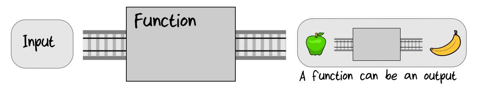
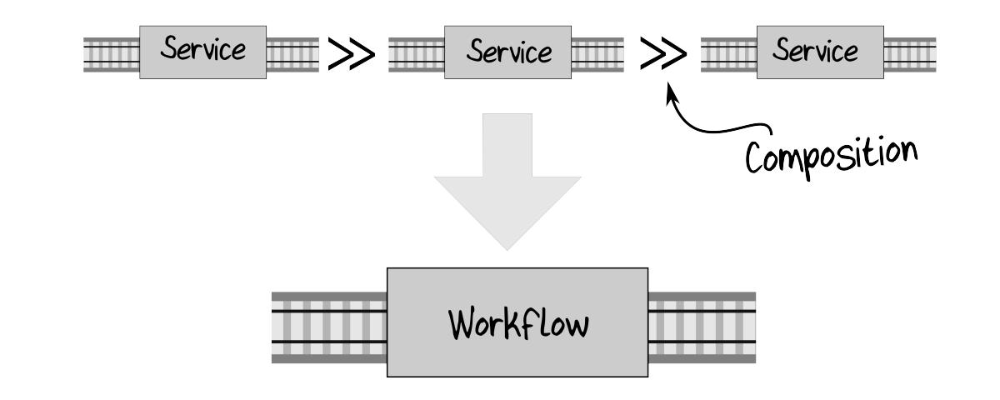
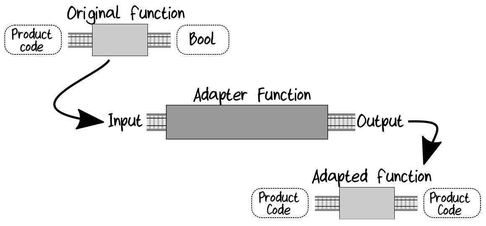

# Chapter 8. Understanding Functions

## Functions, Functions, Everywhere

Ключевым моментом парадигмы ФП является то, что функции используются *для всего* и *везде*.

Примеры отличия ООП подхода от ФП.

* Основные части/сущности из которых собираются большие программы:

  * ООП - классы и объекты.
  * ФП - функции.

* Иструменты параметризации и инструменты уменьшения coupling (связности) между компонентами:

  * ООП - interfaces и dependency injection.
  * ФП - parameterize with functions (параметризация с помощью функций).

* Don't repeat yourself (DRY):

  * ООП - inheritance или technique like the Decorator pattern.
  * ФП - кладем переиспользуемый код в функции и связываем их посредством composition (композиции).


## Functions Are Things

Функции могут быть передаваться на вход:


Функции могут быть возвращаться как выходные параметры:



Функции могут быть передаваться как параметр функции для контроля ее поведения:


>**Higher-Order Functions** (**HOF**s)
>
>Functions that input or output other functions or take functions as parameters are
>called *higher-order functions*, often abbreviated to *HOF*s.

### Treating Functions as Things in F#

4 разных определения функции:

```fsharp
let plus3 x = x + 3             // plus3 : x:int -> int
let times2 x = x * 2            // times2 : x:int -> int
let addThree = plus 3           // addThree : (int -> int)
```

Анонимная (*lambda*) функция:

```fsharp
let square = (fun x -> x * x)   // square : x:int -> int
// аналогична
let square x = x * x            // square : x:int -> int
```

Функции можно put in a list:

```fsharp
// listOfFunctions : (int -> int) list
let listOfFunctions =
    [addThree; times2; square]
```

И можно делать loop:

```fsharp
for fn in listOfFunctions do
    let result = fn 100
    printfn "If 100 is the input, the output is %i" result
```

```text
// Result =>
// If 100 is the input, the output is 103
// If 100 is the input, the output is 200
// If 100 is the input, the output is 10000
```

### Functions as Input

Функция, которая принимает другую функцию в качестве входного параметра:

```fsharp
// evalWhith5ThenAdd2 : fn:(int -> int) -> int
let evalWith5ThenAdd2 fn =
    fn(5) + 2
```

Тест. Входная функция, используемая как параметр для `evalWith5ThenAdd2`:

```fsharp
let add1 x = x + 1          // an int -> int function
evalWith5ThenAdd2 add1      // становится add1(5) + 2
// ответ 8
```

Можно использовать *любую* функцию с сигнатурой `(int -> int)` в качестве входного параметра:

```fsharp
let square x = x * x        // an int -> int function
evalWith5ThenAdd2 square    // становится square(5) + 2
// ответ 27
```

### Function as Output

Функция, возвращающая lambda функцию:

```fsharp
// int -> (int -> int)
let adderGenerator numberToAdd =
    // return a lambda
    fun x -> numberToAdd + x
```

Функция, возвращающая именованную функцию:

```fsharp
let adderGenerator numberToAdd =
    // define a nested inner function
    let innerFn x =
        numberToAdd + x
    // return the inner function
    innerFn
```

Обе функции `adderGenerator` равнозначны.

Использование функции `adderGenerator`:

```fsharp
let add1 = adderGenerator 1
add1 2      // результат 3

let add100 = adderGenerator 100
add100 2    // результат 102
```

### Currying. (Каррирование)

*Currying* (*Каррирование*) - любая функция со множеством параметров может быть представлена
как ряд функций с одним параметром.

Например, функция с двумя параметрами:

```fsharp
// int -> int -> int
let add x y = x + y
```

может быть представлена в виде функции с одним параметром с помощью возвращаемой функции:

```fsharp
// int -> (int -> int)
let adderGenerator x = fun y -> x + y
```

В F# этот прием не надо делать - каждая из функций уже предствлена как curried function.

### Partial Application. (Частичное применение)

Применяя currying можно определить новую функцию: передать "baked in"
параметр и получить новую функцию с меньшим числом параметров.

Такой подход к "baked in" параметров называется *partial application* (*частичным применением*)
и является очень важным функциональным шаблоном.

Пример. Есть функция с двумя параметрами:

```fsharp
// string -> string -> unit
let sayGreetings greeting name =
    printfn "%s %s" greeting name
```

Создание двух новых функций с одним параметром (второй параметр "baked in"):

```fsharp
// string -> unit
let sayHello = sayGreetings "Hello"

// string -> unit
let sayGoodbye = sayGreetings "Goodbye"
```

Применение:

```fsharp
sayHello "Alex"     // результат: "Hello Alex"
sayGoodbye "Alex"   // результат: "Goodbye Alex"
```

## Total Functions

В ФП мы пытаемся сделать функции, чтобы каждому набору входных параметров соответствовал свой
набор выходных параметров (как в математических функциях). Такие функции называются
*total functions* (перевод неясен - полные/целые функции).

Пример. Функция деления 12 на какое-то целое число:

```fsharp
let twelveDivideBy n =
    match n with
    | 6 -> 2
    | 5 -> 2
    | 4 -> 3
    | 3 -> 4
    | 2 -> 6
    | 1 -> 12
    | 0 -> failwith "Can't divide by zero"
```

Один из вариантов деления на ноль - выбрасывание исключения. Но это противоречит сигнатуре
функции `int -> int`: не для каждого входного значения int будет возвращено другое значение int.
Иногда будет выбрасываться исключение.

Как сделать так, чтобы сигнатура `int -> int` была справедлива и не выбрасывались исключения?

### Решение 1. Restrict the input. (Ограничение ввода)

Ограничение диапазона входных значений. Для нашего примера деления:

```fsharp
type NonZeroInteger =
    // Ненулевые целые числа.
    // Сюда добавить smart constructor и т.д.
    private NonZeroInteger of int

// Использование ограниченного ввода

// twelveDivideBy : NonZeroInteger -> int
let twelveDividedBy (NonZeroInteger n) =
    match n with
    | 6 -> 2
    // ...
    // 0 не может быть на входе и его не требуется обрабатывать
```

### Решение 2. Extend the output. (Расширение выходных данных)

Во входных значениях допускается 0, но выходное значение может быть либо *valid int*, либо
*undefined value*.

В F# используется тип `Option` для представления выбора между "something" и "nothing". Пример:

```fsharp
// twelveDivideBy : int -> int option
let twelveDividedBy n =
    match n with
    | 6 -> Some 2       // valid
    | 5 -> Some 2       // valid
    | 4 -> Some 3       // valid
    // ...
    | 0 -> None         // undefined
```

## Composition. (Композиция/составление)

*Function commosition* - комбинирование функций путем присоединения выхода первой ко входу второй:


В итоге получается:


Основная фишка composition: *information hiding* (сокрытие информации).

### Composition of Functions in F#

В F# для composition используется "piping" - символы `|>`.

```fsharp
let add1 x = x + 1          // int -> int
let square x = x * x        // int -> int

let add1ThenSquare x =
    x |> add1 |> square

// Тест
add1ThenSquare 5            // Результат: 36
```

Графически это выглядит так:


Еще пример:

```fsharp
let isEven x =                  // int -> bool
    (x % 2) = 0

let printBool x =               // bool -> string
    sprintf "value is %b" x

let isEvenThePrint x =
    x |> isEven |> printBool    // int -> string

// Тест
isEvenThenPrint 2               // Результат: "value is true"
```

### Building an Entire Application from Functions

Комбинирование функций позволяет из фукнций построить приложение целиком.

Начало:


Далее:


Далее:



Наконец, несколько workflow можно объединить параллельно и создать контроллер/диспетчер для
выбора нужного workflow для соответствующих входных данных:


### Challenges in Composing Functions. (Проблемы при композиции функций)

Composition функций делать легко при совпадении соответствующих входов и выходов. Как быть
если они не совпадают?

Пример.

Выход одной функции `Option<int>`, а другая требует на вход `int`.
Или наоборот, Первая фукция возвращает `int`, а вторая требует на входе `Option<int>`:


Похожие проблемы возникают при использовании типов `Result`, `async` и т.д.

Наиболее популярный подход к решению подобных проблем, это конвертация обоих сторон
(выхода и входа) к "lowest common multiple" ("наименьшее общее кратное").

Например так:


Пример в коде:

```fsharp
// int -> int
let add1 x = x + 1

let printOption x =
    match x with
    | Some i -> printfn "The int is %i" i
    | None -> printfn "No value"

// Connect
5 |> add1 |> Some |> printOption
```

## Wrapping Up

В этой главе:

* знакомство с основными концепциями функционального программирования в F#
* использование функций в качестве строительных блоков
* проектирование функций таким образом, чтобы они были составными.

# Chapter 9. Implementation: Composing a Pipeline

Напоминание. Stages в проектируемом pipeline:

* Начать с `UnvalidatedOrder`, конвертировать его в `ValidatedOrder`. В случае ошибки валидации
возратить ошибку.
* `ValidatedOrder` конвертировать в `PricedOrder`.
* Из `PricedOrder` создать acknowledgment письмо и послать его.
* Создать набор events (событий) и вернуть их.

Итоговая функция для workflow будет выглядеть примерно так:

```fsharp
let placeOrder unvalidatedOrder =
    unvalidatedOrder
    |> validatedOrder
    |> priceOrder
    |> acknowledgeOrder
    |> createEvents
```

Шаги разработки:

1. Реализация каждого шага workflow в виде отдельной функции. Каждая из функций должна быть
stateless, без side effects.

2. Compose (составление/компоновка/комбинирование) функций.

Со вторым шагом могут возникнуть некоторые сложности - некоторые из функций не могут быть
compose (составлены/скомбинированы) из-за:

* Функции с дополнительными параметрами, которые не являются частью data pipeline,
но необходимы для реализации - "зависимости".

* Функции с явным описанием "эффектов", таких как `Result`, `Async`. Они не могут быть compose
(скомбинированы) с функциями, которые ожидают обычные данные на входе.

В этой главе будет реализован шаг 1. В следующей главе шаг 2.
Вначале, для упрощения, будут созданы функции без "эффектов" - без использования `Result`, `Async`
и т.п.

## Working with Simple Types

Сначала определяются simple types (простые типы), такие как `OrderId` и `ProductCode`.

У каждого simple type должно быть минимум по 2 фунции:

* Функция `create` - smart constructor (умный конструктор), который создает тип с проверкой
входного значения. Если проверка не проходит, то возвращает ошибку.

* Функция `value`. Извлекает внутреннее значение.

Обычно определение simple type и его функции лежат в одном файле.

Пример определения `OrderId` в модуле `Domain`:

```fsharp
module Domain =
    type OrderId = private OrderId of string

    module OrderId =
        /// Define a "Smart constructor" for OrderId
        /// string -> OrderId
        let create str =
            if String.IsNullOrEmpty(str) then
                // use exceptions rather than Result for now
                failwith "OrderId must not be null or empty"
            elif str.Length > 50 then
                failwith "OrderId must not be more than 50 chars"
            else
                OrderId str

        /// Extract the inner value from an OrderId
        /// OrderId -> string
        let value (OrderId str) =       // unwrap in the parameter
            str                         // return the inner value
```

Дополнительно, еще может быть `createOption`. Например, если входная строка `null` или пустая,
то возвратится значение `None`, иначе - `Some(String50)`:

```fsharp
let create str =            // string -> String50

let createOption str =      // string -> option<String50>
    if String.IsNullOrEmpty str then
        None
    else
        Some (create str)
```

*Замечания*:

* В умном конструкторе при ошибке валидации используется выброс исключений. Это временно и сделано
для упрощения проектирования. Потом будет заменено на возврат `Result`.
* Функция `value` демонстрирует, как можно сделать pattern-matching и извлечь
внутреннее значение за один шаг, непосредственно в параметре.

## Using Function Types to Guide the Implementation

Определение функции обычным способом:

```fsharp
let validateOrder
    checkProductCodeExists          // dependency
    checkAddressExists              // dependency
    unvalidatedOrder =              // input
    ...
```

Определение функции в определенной сигнатуре (предопределенный тип):

```fsharp
// define a function signature
type MyFunctionSignature = Param1 -> Param2 -> Result

// define a function that implements that signature
let myFunc : MyFunctionSignature =
    fun param1 param2 ->
        // ...
```

Определение функции `validateOrder` будет выглядеть так:

```fsharp
let validateOrder : ValidateOrder =
    fun checkProductCodeExists checkAddressExists unvalidatedOrder ->
     // ^dependency            ^dependency        ^input
```

Применение такого подхода позволяет локализовать ошибку реализации функции в ее пределах,
а не на этапе компоновки всех функций.

Компилятор всегда пытается вывести тип входных и выходных параметров функции из контекста их
использования. Но при таком походе, все параметры и возвращаемое значение функции имеют заранее
заданные типы. Поэтому, если будет сделана ошибка в реализации функции, то она будет сразу видна
как локальная ошибка внутри определения функции.

При обычном определении функции подобного рода ошибки обычно появляются на этапе
компоновки нескольких функций.

>Если есть steps (шаги) в pipeline, которые пока не хочется/неизвестно как реализовать, то можно
>в код ставить временные заглушки без реализации наподобие:
>
>```fsharp
>let priceOrder : PriceOrder =
>    fun getProductPrice validatedOrder ->
>        failwith "not implemented"
>```
>
>Такой подход позволит компилировать проект на любом этапе разработки.

## Implementing the Validation Step

Реализация validation (проверочного) step.

На вход поступает unvalidated order с полями-примитивами, который преобразуется в правильный,
полностью проверенный объект domain (домена).

Описание функций:

```fsharp
type CheckProductCodeExists =
    ProductCode -> bool

type CheckAddressExists =
    UnvalidatedAddress -> AsyncResult<CheckedAddress, AddressValidationError>

type ValidateOrder =
    CheckProductCodeExists                                      // dependency
        -> CheckAddressExists                                   // AsyncResult dependency
        -> UnvalidatedOrder                                     // input
        -> AsyncResult<ValidatedOrder, ValidationError list>    // output
```

Как говорилось выше, вначале, для упрощения, будут созданы функции без "эффектов" - без
использования `Result`, `Async` и т.п.

Поэтому на данном этапе вместо эффектов в случае ошибки будет кидаться исключение (потом, на
следующих этапах, все будет сделано как надо):

```fsharp
type CheckProductCodeExists =
    ProductCode -> bool

type CheckAddressExists =
    UnvalidatedAddress -> CheckedAddress

type ValidateOrder =
    CheckProductCodeExists      // dependency
        -> CheckAddressExists   // dependency
        -> UnvalidatedOrder     // input
        -> ValidatedOrder       // output
```

Пример описания типов, которые требуются для реализации validation step:

* Файл [SimpleTypes.fs](fs/chapter09/OrderTaking/SimpleTypes.fs). Описание simple types
(простых типов) данных. Сделаны по алгоритму, описанному выше, в разделе
"Working with Simple Types".

  * `NonEmptyString`
  * `String10`
  * `String50`
  * `EmailAddress`
  * `ZipCode`
  * `OrderId`
  * `OrderLineId`
  * `ProductCode`, состоит ("OR") из `WidgetCode` и `GizmoCode`
  * `OrderQuantity`, состоит ("OR") из `UnitQuantity` и `KilogramQuantity`

* Файл [CompoundTypes.fs](fs/chapter09/OrderTaking/CompoundTypes.fs). Описание составных типов данных.

  * `PersonalName`
  * `CustomerInfo`
  * `Address`

* Файл [PublicTypes.fs](fs/chapter09/OrderTaking/PublicTypes.fs). Описание типов данных, доступных
"снаружи" domain.

  * `UnvalidatedAddress`
  * `UnvalidatedCustomerInfo`
  * `UnvalidatedOrderLine`
  * `UnvalidatedOrder`

* Файл [PlaceOrder.fs](fs/chapter09/OrderTaking/PlaceOrder.fs). Описание validation step, функций
и типов данных, необходимых для его реализации.

  Данные:

  * `CheckedAddress`
  * `ValidatedOrderLine`
  * `ValidatedOrder`

  Функции:

  * `CheckProductCodeExists`
  * `CheckAddressExists`
  * `ValidateOrders`

Главная функция для этой стадии может выглядеть так:

```fsharp
let validateOrder : ValidateOrder =
    fun checkProductCodeExists checkAddressExists unvalidatedOrder ->

        let orderId =
            unvalidatedOrder.OrderId
            |> OrderId.create

        let customerInfo =
            unvalidatedOrder.CustomerInfo
            |> toCustomerInfo                   // helper function #1

        let shippingAddress =
            unvalidatedOrder.ShippingAddress
            |> toAddress checkAddressExists     // helper function #2

        let billingAddress =
            unvalidatedOrder.BillingAddress
            |> toAddress checkAddressExists     // helper function #2

        // convert each line using 'toValidatedOrderLine'
        let orderLines =
            unvalidatedOrder.Lines
            |> List.map (toValidatedOrderLine checkProductCodeExists)  // helper function #3

        // and so on, for each property of the unvalidatedOrder
        // when all the fields are ready, use them to
        // create and return a new "ValidatedOrder" record
        let validatedOrder = {
            OrderId = orderId
            CustomerInfo = customerInfo
            ShippingAddress = shippingAddress
            BillingAddress = billingAddress
            Lines = orderLines
        }
        validatedOrder
```

### Реализация helper functions

Чтобы начать реализовывать validation step, необходимо создать domain types из non-domain types.

Для преобразования любых non-domain types в domain types надо реализовать helper functions
(вспомогательные функции).

Нужны следующие и подобные функции:

```text
UnvalidatedCustomerInfo -> CustomerInfo         // toCustomerInfo
UnvalidatedAddress -> Address                   // toAddress
UnvalidatedOrderLine -> ValidatedOrderLine
и т.д.
```

### Реализация `toCustomerInfo`. (Helper function #1)

Преобразование `UnvalidatedCustomerInfo` в `CustomerInfo`.

См. файл [PlaceOrder.fs](fs/chapter09/OrderTaking/PlaceOrder.fs):

```fsharp
// ... UnvalidatedCustomerInfo -> CustomerInfo
let toCustomerInfo (customer : UnvalidatedCustomerInfo) : CustomerInfo =
    let firstName = customer.FirstName |> String50.create
    let lastName = customer.LastName |> String50.create
    let emailAddress = customer.EmailAddress |> EmailAddress.create

    // create a PersonalName
    let name = {
        FirstName = firstName           // ... String50
        LastName = lastName             // ... String50
    }

    // create a CustomerInfo
    let customerInfo = {
        Name = name                     // ... PersonalName
        EmailAddress = emailAddress     // ... EmailAddress
    }

    customerInfo
```

### Creating a Valid, Checked Address. (Helper function #2)

См. файл [PlaceOrder.fs](fs/chapter09/OrderTaking/PlaceOrder.fs):

`CheckedAddress` содержит только значения `string`, так же как и `UnvalidatedAddress`

```fsharp
type CheckedAddress = CheckedAddress of UnvalidatedAddress

// ... CheckAddressExists -> UnvalidatedAddress -> Address
let toAddress (checkAddressExists : CheckAddressExists) unvalidatedAddress =
    // call the remote service
    let checkedAddress = checkAddressExists unvalidatedAddress
    // extract the inner value using pattern matching
    let (CheckedAddress inner) = checkedAddress       // inner - UnvalidatedAddress

    // все значения в inner это string
    let addressLine1 = inner.AddressLine1 |> String50.create
    let addressLine2 = inner.AddressLine2 |> String50.createOption
    let addressLine3 = inner.AddressLine3 |> String50.createOption
    let addressLine4 = inner.AddressLine4 |> String50.createOption
    let city = inner.City |> String50.create
    let zipCode = inner.ZipCode |> ZipCode.create

    // create the Address
    let address = {
        AddressLine1 = addressLine1     // ... String50
        AddressLine2 = addressLine2     // ... String50 option
        AddressLine3 = addressLine3     // ... String50 option
        AddressLine4 = addressLine4     // ... String50 option
        City = city                     // ... String50
        ZipCode = zipCode               // ... ZipCode
    }

    address     // ... Address
```

### Creating the Order Lines. (Helper function #3)

Преобразование `UnvalidatedOrderLine` в `ValidatedOrderLine`

См. файл [PlaceOrder.fs](fs/chapter09/OrderTaking/PlaceOrder.fs):

```fsharp
// ... CheckProductCodeExists -> UnvalidatedOrderLine -> ValidatedOrderLine
let toValidatedOrderLine checkProductCodeExists
    (unvalidatedOrderLine : UnvalidatedOrderLine) =
    let orderLineId =
        unvalidatedOrderLine.OrderLineId            //...string
        |> OrderLineId.create                       //...OrderLineId
    let productCode =
        unvalidatedOrderLine.ProductCode            //...string
        |> toProductCode checkProductCodeExists     //...ProductCode
    let quantity =
        unvalidatedOrderLine.Quantity               //...decimal
        |> OrderQuantity.create productCode         //...OrderQuantity
    let validatedOrderLine = {
        OrderLineId = orderLineId
        ProductCode = productCode
        Quantity = quantity
    }
    validatedOrderLine          // ... ValidatedOrderLine
```

Где `toProductCode` это helper function.

#### Первый поход к описанию функции `toProductCode`

`CheckProductCodeExists` - это внешний сервис, проверяющий существование `ProductCode`. Его
сигнатура:

```fsharp
type CheckProductCodeExists =
    ProductCode -> bool
```

Таким образом, получится функция:

```fsharp
// ... CheckProductCodeExists -> string -> bool
let toProductCode (checkProductCodeExists : CheckProductCodeExists) productCode =
    productCode                 // ... string
    |> ProductCode.create       // ... ProductCode
    |> checkProductCodeExists   // ... bool
```

Но на выходе этой функции `bool`, а нам требуется `ProductCode`. Для преобразования
данных можно использовать **Function Adapter**.

### Creating Function Adapters

"Adapter" function - принимает исходную функцию на вход и выдает новую функцию с нужной
"shape" (формой) данных.

Подобного рода функции также называются "function transformer".



Для нашего случая можно написать такую функцию:

```fsharp
// ... ('a -> bool) -> 'a -> 'a
let predicateToPassthru checkProductCodeExists productCode =
    if checkProductCodeExists productCode then
        productCode
    else
        failwith "Invalid Product Code"
```

Сигнатура этой функции-адаптера автоматически определяется компилятором как:

```text
('a -> bool) -> 'a -> 'a
```

Поэтому:

1. Для generic переменных можно использовать более абстрактные короткие имена.
2. Hard-coded сообщение можно вынести как параметр, чтобы функция была переиспользуемой.

В итоге, получится так (см. тут [PlaceOrder.fs](fs/chapter09/OrderTaking/PlaceOrder.fs)):

```fsharp
// ... string -> ('a -> bool) -> 'a -> 'a
let predicateToPassthru errorMsg f x =
    if f x then
        x
    else
        failwith errorMsg
```

#### Возврат к функции `toProductCode`

Теперь, можно описать `toProductionCode` с использованием `predicateToPassthru`:

```fsharp
// ... CheckProductCodeExists -> string -> bool
let toProductCode (checkProductCodeExists : CheckProductCodeExists) productCode =
    // create a local ProductCode -> ProductCode function
    // suitable for using in a pipeline
    let checkProduct productCode =
        let errorMsg = sprintf "Invalid: %A" productCode
        predicateToPassthru errorMsg checkProductCodeExists productCode

    productCode                 // ... string
    |> ProductCode.create       // ... ProductCode
    |> checkProduct             // ... ProductCode
```

Что нам и требовалось.

### Объединение всего в функцию `validateOrder`

См. функцию тут [PlaceOrder.fs](fs/chapter09/OrderTaking/PlaceOrder.fs):

```fsharp
// ... CheckProductCodeExists -> CheckAddressExists -> UnvalidatedOrder -> ValidatedOrder
let validateOrder : ValidateOrder =
    fun checkProductCodeExists checkAddressExists unvalidatedOrder ->
        let orderId =
            unvalidatedOrder.OrderId            //...string
            |> OrderId.create                   //...OrderId
        let customerInfo =
            unvalidatedOrder.CustomerInfo       //...UnvalidatedCustomerInfo
            |> toCustomerInfo                   //...CustomerInfo
        let shippingAddress =
            unvalidatedOrder.ShippingAddress    //...UnvalidatedAddress
            |> toAddress checkAddressExists     //...Address
        let billingAddress =
            unvalidatedOrder.BillingAddress     //...UnvalidatedAddress
            |> toAddress checkAddressExists     //...Address
        let lines =
            unvalidatedOrder.Lines              //...UnvalidatedOrderLine list
            |> List.map (toValidatedOrderLine checkProductCodeExists)   //...ValidatedOrderLine list
        let validatedOrder : ValidatedOrder = {
            OrderId = orderId
            CustomerInfo = customerInfo
            ShippingAddress = shippingAddress
            BillingAddress = billingAddress
            Lines = lines
        }
        validatedOrder
```

## Implementing the Rest of the Steps

После реализации `validateOrder` надо реализовать остальные функции, используя те же самые
подходы.

Описание price order step с "эффектами".

```fsharp
type PriceOrder =
    GetProductPrice                                 // dependency
        -> ValidateOrder                            // input
        -> Result<PricedOrder, PlaceOrderError>     // output
```

Как говорилось выше, вначале, для упрощения, будут созданы функции без "эффектов" - без
использования `Result`, `Async` и т.п.

Поэтому на данном этапе вместо эффектов в случае ошибки будет кидаться исключение (потом, на
следующих этапах, все будет сделано как надо):

```fsharp
type GetProductPrice = ProductCode -> Price

type PriceOrder =
    GetProductPrice             // dependency
        -> ValidatedOrder       // input
        -> PricedOrder          // output
```

Дописаны еще типы, которые требуются для реализации price order step:

* Файл [SimpleTypes.fs](fs/chapter09/OrderTaking/SimpleTypes.fs). Описание simple types
(простых типов) данных.

  * `Price`
  * `BillingAmount` (немного про него будет далее)

* Файл [PublicTypes.fs](fs/chapter09/OrderTaking/PublicTypes.fs). Описание типов данных, доступных
"снаружи" domain.

  * `PricedOrderLine`
  * `PricedOrder`

* Файл [PlaceOrder.fs](fs/chapter09/OrderTaking/PlaceOrder.fs). Описание price order step, функций
и типов данных, необходимых для его реализации.

  Функции:

  * `GetProductPrice`
  * `PriceOrder`

Главная функция для этой стадии выглядит так [PlaceOrder.fs](fs/chapter09/OrderTaking/PlaceOrder.fs):

```fsharp
// ... GetProductPrice -> ValidatedOrder -> PricedOrder
let priceOrder : PriceOrder =
    fun getProductPrice validatedOrder ->
        let lines =
            validatedOrder.Lines                                //...ValidatedOrderLine list
            |> List.map (toPricedOrderLine getProductPrice)     //...PricedOrderLine list
        let amountToBill =
            lines                                               //...PricedOrderLine list
            |> List.map (fun line -> line.LinePrice)            //...Price list
            |> BillingAmount.sumPrices                          //...BillingAmount
        let pricedOrder : PricedOrder = {
            OrderId = validatedOrder.OrderId                    //...OrderId
            CustomerInfo = validatedOrder.CustomerInfo          //...CustomerInfo
            ShippingAddress = validatedOrder.ShippingAddress    //...ShippingAddress
            BillingAddress = validatedOrder.BillingAddress      //...BillingAddress
            Lines = lines                                       //...PricedOrderLine list
            AmountToBill = amountToBill                         //...BillingAmount
        }
        pricedOrder
```

Здесь есть две helper functions:

1. `BillingAmount.sumPrices` - helper function #1
2. `toPricedOrderLine` - helper function #2

### Creating `BillingAmount.sumPrices`. (Helper function #1)

Для типа `BillingAmount` помимо методов `value`, `validate` и `create` добавлен метод
`sumPrices` (см. [SimpleTypes.fs](fs/chapter09/OrderTaking/SimpleTypes.fs)):

```fsharp
// ... list<Price> -> BillingAmount
let sumPrices prices =
    let total =
        prices                      // ... Price list
        |> List.map Price.value     // ... decimal list
        |> List.sum                 // ... decimal
    create total
```

где `Price` - тип-обертка над типом decimal

```fsharp
type Price = private Price of decimal
```

### Creating `toPricedOrderLine`. (Helper function #2)

Вспомогательная функция `toPricedOrderLine` трансформирует `ValidatedOrderLine`
в `PricedOrderLine`.

См. в файле [PlaceOrder.fs](fs/chapter09/OrderTaking/PlaceOrder.fs):

```fsharp
// ... (ProductCode -> Price) -> ValidatedOrderLine -> PricedOrderLine
let toPricedOrderLine getProductPrice (line : ValidatedOrderLine) : PricedOrderLine =
    let qty = line.Quantity |> OrderQuantity.value      //...decimal
    let price = line.ProductCode |> getProductPrice     //...Price
    let linePrice = price |> Price.multiply qty         //...Price

    {                                       //...PricedOrderLine
        OrderLineId = line.OrderLineId      //...OrderLineId
        ProductCode = line.ProductCode      //...ProductCode
        Quantity = line.Quantity            //...OrderQuantity
        LinePrice = linePrice               //...Price
    }
```

где `Price.multiply` ([SimpleTypes.fs](fs/chapter09/OrderTaking/SimpleTypes.fs)):

```fsharp
// ... decimal -> Price -> Price
let multiply qty (Price p) =
    create (qty * p)
```

это простое перемножение цены на количество товаров.

### Implementing the Acknowledgment (подтверждение) Step

Изменения в файле [PublicTypes.fs](fs/chapter09/OrderTaking/PublicTypes.fs):

```fsharp
/// Event will be created if the Acknowledgment was successfully posted.
type OrderAcknowledgmentSent = {
    OrderId : OrderId
    EmailAddress : EmailAddress
}
```

Добавление в файл [PlaceOrder.fs](fs/chapter09/OrderTaking/PlaceOrder.fs)
простых типов данных и сигнатур функций:

```fsharp
type HtmlString = HtmlString of string

type OrderAcknowledgment = {
    EmailAddress : EmailAddress
    Letter : HtmlString
}

type SendResult = Send | NotSend

type CreateOrderAcknowledgmentLetter =
    PricedOrder -> HtmlString

type SendOrderAcknowledgment =
    OrderAcknowledgment -> SendResult

type AcknowledgeOrder =
    CreateOrderAcknowledgmentLetter
        -> SendOrderAcknowledgment
        -> PricedOrder
        -> OrderAcknowledgmentSent option
```

Реализация основной функции acknowledgment step (см. [PlaceOrder.fs](fs/chapter09/OrderTaking/PlaceOrder.fs)):

```fsharp
// ... CreateOrderAcknowledgmentLetter : PricedOrder -> HtmlString
// ... SendOrderAcknowledgment : OrderAcknowledgment -> SendResult
// ... CreateOrderAcknowledgmentLetter -> SendOrderAcknowledgment -> PricedOrder -> OrderAcknowledgmentSent option
let acknowledgeOrder : AcknowledgeOrder =
    fun createAcknowledgmentLetter sendAcknowledgment pricedOrder ->
        let letter = createAcknowledgmentLetter pricedOrder         //...HtmlString
        let acknowledgment = {                                      //...OrderAcknowledgment
            EmailAddress = pricedOrder.CustomerInfo.EmailAddress
            Letter = letter
        }

        // if the acknowledgment was successfully sent,
        // return the corresponding event, else return None
        // ... SendOrderAcknowledgment -> OrderAcknowledgment -> OrderAcknowledgmentSent option
        match sendAcknowledgment acknowledgment with
        | Sent ->
            let event = {       // OrderAcknowledgmentSent
                OrderId = pricedOrder.OrderId
                EmailAddress = pricedOrder.CustomerInfo.EmailAddress
            }
            Some event
        | NotSent ->
            None
```

Реализацию зависимости `sendAcknowledgment` решено отложить "на потом".

### Creating the Events

Создадим события, которые будут возвращены из рабочего процесса.

Уточнение к требованиям: событие выставления счетов следует отправлять только в том случае,если подлежащая оплате сумма больше нуля.

События (см. файл [PublicTypes.fs](fs/chapter09/OrderTaking/PublicTypes.fs)):

```fsharp
/// Event to send to shipping context.
type OrderPlaced = PricedOrder

/// Event to send to billing context.
/// Will only be created if the AmountToBill is not zero.async
type BillableOrderPlaced = {
    OrderId : OrderId
    BillingAddress : Address
    AmountToBill : BillingAmount
}

/// The possible events resulting from the PlaceOrder workflow
/// Not all events will occur, depending on the logic of the workflow
type PlaceOrderEvent =
    | OrderPlaced of OrderPlaced
    | BillableOrderPlaced of BillableOrderPlaced
    | AcknowledgmentSent of OrderAcknowledgmentSent
```

Напоминание. Из предыдущего раздела событие `OrderAcknowledgmentSent`:

```fsharp
/// Event will be created if the Acknowledgment was successfully posted.
type OrderAcknowledgmentSent = {
    OrderId : OrderId
    EmailAddress : EmailAddress
}
```

Описании функции, которая будет создавать все эти события (см. в файле [PlaceOrder.fs](fs/chapter09/OrderTaking/PlaceOrder.fs)):

```fsharp
type CreateEvents =
    PricedOrder                                 // input
        -> OrderAcknowledgmentSent option       // input (event from previous step)
        -> PlaceOrderEvent list                 // output
```

Реализация функции для создания `BillableOrderPlaced`:

```fsharp
// ... PricedOrder -> BillableOrderPlaced option
let createBillingEvent (placedOrder : PricedOrder) : BillableOrderPlaced option =
    let billingAmount = placedOrder.AmountToBill |> BillingAmount.value
    if billingAmount > 0M then
        let order = {                           // BillableOrderPlaced
            OrderId = placedOrder.OrderId
            BillingAddress = placedOrder.BillingAddress
            AmountToBill = placedOrder.AmountToBill
        }
        Some order
    else
        None
```

Для создания всех событий надо три события `OrderPlaced`, `BillableOrderPlaced`
и `PlaceOrderEvent`:

1. Упаковать в `PlaceOrderEvent`. Каждый.
2. По требованиям, `BillableOrderPlaced` и `PlaceOrderEvent` возвращаются как `option`.
3. `PlaceOrderEvent` возвращается в виде `list`.

Поэтому в данном случае необходимо использовать подход "lowest common multiple" ("наименьшее общее
кратное") - было описано выше.

Функция `createEvent` для создания всех событий:

```fsharp
// ... PricedOrder -> OrderAcknowledgmentSent -> PlaceOrderEvent list
let createEvents : CreateEvents =
    fun pricedOrder acknowledgmentEventOpt ->
        let event1 =
            pricedOrder                         //...PricedOrder
            |> PlaceOrderEvent.OrderPlaced      //...PlaceOrderEvent
        let event2Opt =
            acknowledgmentEventOpt                              //...OrderAcknowledgmentSent option
            |> Option.map PlaceOrderEvent.AcknowledgmentSent    //...PlaceOrderEvent option
        let event3Opt =
            pricedOrder                                         //...PricedOrder
            |> createBillingEvent                               //...BillableOrderPlaced option

        // Как объединить все события?
        ...
```

Для упаковки обычного значения в list можно использовать стандартную фукцию `List.singleton`.
Она просто упаковывает значение в list:

```text
// 'T -> list<'T>
List.Singleton value = ...
```

Вспомогательная функция для упаковки `option<value>` в `list<value>` (см. файл [PlaceOrder.fs](fs/chapter09/OrderTaking/PlaceOrder.fs):

```fsharp
/// Helper to convert an Option into a List.
// ... option<'a> -> list<'a>
let listOfOption opt =
    match opt with
    | Some x -> [x]
    | None -> []
```

Итоговая функция будет выглядеть так (см. файл [PlaceOrder.fs](fs/chapter09/OrderTaking/PlaceOrder.fs):

```fsharp
// ... PricedOrder -> OrderAcknowledgmentSent -> PlaceOrderEvent list
let createEvents : CreateEvents =
    fun pricedOrder acknowledgmentEventOpt ->
        let events1 =
            pricedOrder                         //...PricedOrder
            |> PlaceOrderEvent.OrderPlaced      //...PlaceOrderEvent
            |> List.singleton                   //...PlaceOrderEvent list
        let events2 =
            acknowledgmentEventOpt                              //...OrderAcknowledgmentSent option
            |> Option.map PlaceOrderEvent.AcknowledgmentSent    //...PlaceOrderEvent option
            |> listOfOption                                     //...PlaceOrderEvent list
        let events3 =
            pricedOrder                                         //...PricedOrder
            |> createBillingEvent                               //...BillableOrderPlaced option
            |> Option.map PlaceOrderEvent.BillableOrderPlaced   //...PlaceOrderEvent option
            |> listOfOption                                     //...PlaceOrderEvent list

        // return all the events
        [
            yield! events1
            yield! events2
            yield! events3
        ]
```

## Composing the Pipeline Steps Together

Объединение всех стадий/шагов в workflow хочется чтобы выглядело так:

```fsharp
let placeOrder : PlaceOrderWorkflow =
    fun unvalidatedOrder ->
        unvalidatedOrder
        |> validateOrder
        |> priceOrder
        |> acknowledgeOrder
        |> createEvents
```

Но в функциях возникают проблемы с компоновкой: у некоторых из них количество входов не совпадает
с количеством входных значений из предыдущих стадий.

Например, для `validateOrder`:


```fsharp
// ... CheckProductCodeExists -> CheckAddressExists -> UnvalidatedOrder -> ValidatedOrder
let validateOrder : ValidateOrder = ...
```

Или для `priceOrder`:


```fsharp
// ... GetProductPrice -> ValidatedOrder -> PricedOrder
let priceOrder : PriceOrder = ...
```

Composing (составление) функций с различными "формами", является одной из основных проблем в
функциональном программировании. Большинство решений используют страшную "монаду". Но сейчас,
для упрощения, будет использован подход partial application (частичное применение).

Применим два из трех параметров к `validateOrder` (две зависимости), что даст новую
функцию только с одним входом:


В коде partial application будет выгляеть так:

```fsharp
// UnvalidatedOrder -> ValidatedOrder
let validateOrderWithDependenciesBakedIn =
    validateOrder checkProductCodeExists checkAddressExists
```

Используя "shadowing" локально можно назвать функцию как и applied или использовать символ `'`:

```fsharp
// UnvalidatedOrder -> ValidatedOrder
let validateOrder =
    validateOrder checkProductCodeExists checkAddressExists

let validateOrder' =
    validateOrder checkProductCodeExists checkAddressExists
```

Аналогично, partial application можно сделать для функции `priceOrder`:


Используя partial application, главную функцию workflow `placeOrder` можно записать так:

```fsharp
type PlaceOrderWorkflow =
    UnvalidatedOrder -> PlaceOrderEvent list

// ... UnvalidatedOrder -> PlaceOrderEvent list
let placeOrder : PlaceOrderWorkflow =
    let validateOrder =
        validateOrder checkProductCodeExists checkAddressExists
    let priceOrder =
        priceOrder getProductPrice
    let acknowledgeOrder =
        acknowledgeOrder createAcknowledgmentLetter sendOrderAcknowledgment
    fun unvalidatedOrder ->
        unvalidatedOrder
        |> validateOrder
        |> priceOrder
        |> acknowledgeOrder
        |> createEvents
```

Здесь функция `acknowledgeOrder` не компонуется с `createEvents`. Можно написать небольшую
функцию-адаптер. Или можно реализовать функцию `placeOrder` в императивном стиле:

```fsharp
type PlaceOrderWorkflow =
    UnvalidatedOrder -> PlaceOrderEvent list

// ... UnvalidatedOrder -> PlaceOrderEvent list
let placeOrder : PlaceOrderWorkflow =
    fun unvalidatedOrder ->
        let validatedOrder =
            unvalidatedOrder
            |> validateOrder checkProductCodeExists checkAddressExists
        let pricedOrder =
            validatedOrder
            |> priceOrder getProductPrice
        let acknowledgementOption =
            pricedOrder
            |> acknowledgeOrder createAcknowledgmentLetter sendOrderAcknowledgment
        let events =
            createEvents pricedOrder acknowledgementOption
        events
```

Но, опять проблема. Как получить зависимости:

* `checkProductCodeExists`
* `checkAddressExists`
* `getProductPrice`
* `createAcknowledgmentLetter`
* `sendOrderAcknowledgment`
?

## Injecting Dependencies

Как получить зависимости от верхнего уровня вплоть до нижних функций?

В ООП в таких случаях используется внедрение зависимостей и, возможно, контейнер IoC.

В ФП этот прием не используется, т.к. зависимости становятся неявными.
Вместо этого зависимости всегда передаются в виде явных параметров, что гарантирует
их очевидность.

В ФП есть ряд методов для выполнения такого рода задач: "Reader Monad" и
"Free Monad". В этой книге используется самый простой способ:
все зависимости передаются в функции верхнего уровня, которые затем передают
их во внутренние функции и так далее.

Вот как будет выглядеть главная функция workflow `placeOrder`
(см. файл [PlaceOrder.fs](fs/chapter09/OrderTaking/PlaceOrder.fs):

```fsharp
// ... CheckProductCodeExists -> CheckAddressExists -> GetProductPrice ->
// ...      CreateOrderAcknowledgmentLetter -> SendOrderAcknowledgment ->
// ...      UnvalidatedOrder -> PlaceOrderEvent list
let placeOrder
    checkProductCodeExists          // dependency
    checkAddressExists              // dependency
    getProductPrice                 // dependency
    createAcknowledgmentLetter      // dependency
    sendOrderAcknowledgment         // dependency
        : PlaceOrderWorkflow =      // function definition
    fun unvalidatedOrder ->
        let validatedOrder =            // ValidatedOrder
            unvalidatedOrder            // UnvalidatedOrder
            |> validateOrder checkProductCodeExists checkAddressExists
        let pricedOrder =               // PricedOrder
            validatedOrder              // ValidatedOrder
            |> priceOrder getProductPrice
        let acknowledgementOption =     // OrderAcknowledgmenSent option
            pricedOrder                 // PricedOrder
            |> acknowledgeOrder createAcknowledgmentLetter sendOrderAcknowledgment
        let events =                    // PlaceOrderEvent list
            createEvents pricedOrder acknowledgementOption
        events
```

В ООП и ФП функцию или класс верхнего уровня, где производится настройка и установка всех
зависимостей обычно называют *composition root* (корень композиции).

Настройка и установка зависимостей на самом верхнем уровне имеет большое достоинство:
все нижние функции можно легко протестировать, используя mock'и.

На практике composition root должен быть как можно ближе к точке входа приложения - функции
`main` для консольных приложений или обработчику `OnStartup/Application_Start`
для длительно работающих приложений, таких как веб-сервисы.

Пример для composition root в [Suave framework](https://suave.io/):

```fsharp
let app : WebPart =
    // set up the services used by the workflow
    let checkProductExists = ...
    let checkAddressExists = ...
    let getProductPrice = ...
    let createOrderAcknowledgmentLetter = ...
    let sendOrderAcknowledgment = ...
    let toHttpResponse = ...

    // set up the "placeOrder" workflow
    // by partially applying the services to it
    let placeOrder =
        placeOrder
            checkProductExists
            checkAddressExists
            getProductPrice
            createOrderAcknowledgmentLetter
            sendOrderAcknowledgment

    // set up the other workflows
    let changeOrder = ...
    let cancelOrder = ...

    // set up the routing
    choose
        [ POST >=> choose
            [
                path "/placeOrder"
                    >=> deserializeOrder    // convert JSON to UnvalidatedOrder
                    >=> placeOrder          // do the workflow
                    >=> postEvents          // post the events onto queues
                    >=> toHttpResponse      // return 200/400/etc based on the output
                path "/changeOrder"
                    >=> ...
                path "/cancelOrder"
                    >=> ...
            ]
        ]
```

## Too Many Dependencies? Слишком много зависимостей?

Что делать, если у функции слишком много зависимостей?

### Решение 1. Разбить функцию на более мелкие части

Функция делает очень много всего. Попробовать разбить на более мелкие части.

### Решение 2. Сгруппировать зависимости

Сгруппировать зависимости в record и передать их в функцию в виде одного параметра.

### Решение 3. Использование "prebuilt" helper функции

Зависимости могут пронизывать насквозь всю иерархию функций, с верхнего уровня до нижнего, где
они и используются (и больше нигде).

Это портит дизайн, т.к. всем промежуточным функциям не нужно ничего знать о зависимостях
нижних функций.

Гораздо лучше задать все зависимости для низкоуровневой функции на верхнем уровне,
а затем просто передать эту функцию с prebuild baked in dependencies в головную
функцию, где она будет использована.

Пример. **Плохо**. (`validate` явно видит зависимости `toAddress`):

```fsharp
let toAddress checkAddressExists endPoint credentials unvalidatedAddress =
    //                        only ^ needed ^ for checkAddressExists

    // call the remote service
    let checkedAddress = checkAddressExists endPoint credentials unvalidatedAddress
    //                     2 extra parameters ^ passed in ^
//...

let validateOrder
    checkProductExists
    checkAddressExists
    endPoint            // only needed for checkAddressExists
    credentials         // only needed for checkAddressExists
    unvalidatedOrder =
//...
```

Пример. **Хорошо**.:

```fsharp
let placeOrder : PlaceOrderWorkflow =
    // initialize information (e.g from configuration)
    let endPoint = ...
    let credentials = ...

    // make a new version of checkAddressExists
    // with the credentials baked in
    let checkAddressExists = checkAddressExists endPoint credentials

    // set up the steps in the workflow
    let validateOrder =
        validateOrder checkProductCodeExists checkAddressExists
        // the new checkAddressExists ^
        // is a one parameter function
    //...
```

Такой подход использования "prebuilt" helper функции является распространенным приемом,
который помогает упростить дизайн.
Когда одна функция передается в другую функцию, "интерфейс" (сигнатура) функции должен быть
как можно более минимальным, со всеми скрытыми зависимостями.

## Testing Dependencies

Преимущество явной передачи зависимостей проявляется в легкости тестирования.

Здесь приведен пример unit-тестов, с использованием NUnit. Тесты
можно посмотреть в [UnitTests.fs](/fs/chapter09/Tests/UnitTests.fs).

Особенности:

* В F# методы можно писать с пробелами и пунктуацией используя двойной символ backtick:

```fsharp
let ``If product doesn't exists, validation fails`` () =
//...
```

* Легкость тестирования
  * Тестируемая функция чистая - не имеет состояния и ничего не меняет.
  * Все зависимости функции явные и легко заменяемые.
  * Все side effects инкапсулируются в параметрах, а не непосредственно в самой функции.

### F# testing frameworks

В F# для тестирования можно использовать стандартные .NET framework'и: MSTest, NUnit, XUnit.

Но еще есть специальные тестовые tools для использования с F#:

* `FsUnit` wraps standard test frameworks like NUnit and XUnit with F#-friendly syntax.
* `Unquote` shows all the values leading up to a test failure ("unrolling the
stack" as it were).
* `FsCheck` - реализация "property-based" подхода к тестированию.
* `Expecto` is a lightweight F# testing framework that uses standard functions
as test fixtures instead of requiring special attributes like `[<Test>]`.

## The Assembled Pipeline. Сборка pipeline

Собираем pipeline из определений типов и функций, реализаций функций в единый pipeline.

Основные положения:

1. Мы помещаем весь код, реализующий определенный рабочий процесс, в один и тот же
модуль, названный в честь рабочего процесса (например, `PlaceOrderWorkflow.fs`).
В моей версии реализации файл назван как
[PlaceOrder.fs](fs/chapter09//OrderTaking/PlaceOrder.fs).

2. В верхней части файла мы помещаем определения типов и функций.

3. После этого мы помещаем implementations для каждого step (шага/стадии f).

4. В самом низу файла собираем steps (шаги/стадии) в основную функцию wokflow.

Плюс есть еще пара файлов, которые имеют разделяемые данные для нескольких workflow.
Порядок описания кода в файлах такой же.

* [SimpleTypes.fs](fs/chapter09/OrderTaking/SimpleTypes.fs) - описание и реализация простых
типов данных.

* [PublicTypes.fs](fs/chapter09/OrderTaking/PublicTypes.fs) - описание и реализация
публичных типов данных, описываемых в API workflow.

Пример частей файла `PlaceOrderWorkflow.fs`:

```fsharp
module PlaceOrderWorkflow =

open SimpleTypes    // открытие модуля с общими простыми типами данных
open API            // публичные типы данных, входящие в API

// ==============================
// Part 1: Design
// ==============================

// ----- Validate Order -----
type CheckProductCodeExists = ProductCode -> bool
type CheckedAddress = CheckedAddress of UnvalidatedAddress
type CheckAddressExists = UnvalidatedAddress -> CheckedAddress

type ValidateOrder =
    CheckProductCodeExists          // dependency
        -> CheckAddressExists       // dependency
        -> UnvalidatedOrder         // input
        -> ValidatedOrder           // output

// ----- Price order -----
type GetProductPrice = ...
type PriceOrder = ...
```

After the types, in the same file, we can put the implementations that are
based on those types:

```fsharp
// ==============================
// Part 2: Implementation
// ==============================

// ------------------------------
// ValidateOrder implementation
// ------------------------------

// Вспомогательные функции для функции validateOrder
let toCustomerInfo (unvalidatedCustomerInfo: UnvalidatedCustomerInfo) = // ...
let toAddress (checkAddressExists:CheckAddressExists) unvalidatedAddress = // ...
let predicateToPassthru = // ...
let toProductCode (checkProductCodeExists:CheckProductCodeExists) productCode = //...
let toOrderQuantity productCode quantity = //...
let toValidatedOrderLine checkProductExists (unvalidatedOrderLine:UnvalidatedOrderLine) = //...

/// Implementation of ValidateOrder step
let validateOrder : ValidateOrder =
    fun checkProductCodeExists checkAddressExists unvalidatedOrder ->
        let orderId =
            unvalidatedOrder.OrderId
            |> OrderId.create
        let customerInfo = ...
        let shippingAddress = ...
        let billingAddress = ...
        let lines =
            unvalidatedOrder.Lines
            |> List.map (toValidatedOrderLine checkProductCodeExists)
        let validatedOrder : ValidatedOrder = {
            OrderId = orderId
            CustomerInfo = customerInfo
            ShippingAddress = shippingAddress
            BillingAddress = billingAddress
            Lines = lines
        }
        validatedOrder
```

Аналогично делается реализация для всех остальных steps.
В самом низу файла описывается реализация главной функции workflow:

```fsharp
// ------------------------------
// The complete workflow
// ------------------------------
let placeOrder
    checkProductExists                  // dependency
    checkAddressExists                  // dependency
    getProductPrice                     // dependency
    createOrderAcknowledgmentLetter     // dependency
    sendOrderAcknowledgment             // dependency
    : PlaceOrderWorkflow =              // definition of function

    fun unvalidatedOrder ->
        let validatedOrder =
            unvalidatedOrder
            |> validateOrder checkProductExists checkAddressExists
        let pricedOrder =
            validatedOrder
            |> priceOrder getProductPrice
        let acknowledgmentOption =
            pricedOrder
            |> acknowledgeOrder createOrderAcknowledgmentLetter sendOrderAcknowledgment
        let events =
            createEvents pricedOrder acknowledgmentOption
        events
```

## Wrapping Up

В этой главе был реализован workflow:

* Реализация workflow steps.
* Работа с зависимостями.
* Реализацию каждого шага легко протестировать в изоляции.
* При несовпадении входных и выходных типов функций использовались следующие методы:
  * Использование *adapter function* (функции адаптера) для преобразования функции из
  одной "формы" в другую.
  * *"Lifting"* отдельных типов в один общий тип.
  * Использование *partial application* (частичного применения) для встраивания зависимостей
  в функцию.

# Links

* [Suave framework](https://suave.io/)

* F# testing frameworks: `FsUnit`, `Unquote`, `FsCheck`, `Expecto`.

# Chapter 10. Implementation: Working with Errors

Любая система может иметь ошибки и те способы, как мы работаем с ошибками очень важны.
Последовательная и прозрачная обработка ошибок имеет решающее значение для любой системы,
готовой к работе.

В этой главе в дополнение к предыдущей, вводится обработка ошибок ("эффектов")
при реализации pipeline в функциональном стиле.

## Using the Result Type to Make Errors Explicit

ФП сосредоточена на более явном определении функций - могут ли они завершить свое выполнение
ошибкой и какого рода эта ошибка будет.

Ошибки часто рассматриваются как "граждане второго сорта". Нужно относиться к ошибкам как
к "первоклассным гражданам". И вдвойне важно для ошибок, которые являются частью domain.

Например, функция проверки адреса (см. предыущую главу) имела такое определение,
а "под капотом" кидала исключение:

```fsharp
type CheckAddressExists =
    UnvalidatedAddress -> CheckedAddress
```

Это определение крайне бесполезно, потому что не указывает на то, что может пойти не так.

Чтобы было ясно, что функция может быть выполнена успешно или с ошибкой можно использовать тип
`Result`, и тогда определение будет выглядеть примерно так:

```fsharp
type CheckAddressExists =
    UnvalidatedAddress -> Result<CheckedAddress,AddressValidationError>

and AddressValidationError =
    | InvalidFormat of string
    | AddressNotFound of string
```

Это определение может сказать нам следующее:

* На входе ожидается `UnvalidatedAddress` (неподтвержденный адрес).
* Если проверка прошла успешно, результатом будет `CheckedAddress` (возможно будет другой адрес).
* Если проверка не прошла, то причина может быть в том, что:
  * `InvalidFormat` (неверный формат адреса)
  * `AddressNotFound` (адрес не был найден).

Это показывает, как сигнатура функции может выступать в качестве документации.

## Working with Domain Errors

Можно разделить ошибки в ПО на три группы:

* **Domain Errors** (ошибки домена). Это ошибки, которые следует ожидать как часть бизнес-процесса
и, следовательно, должны быть включены в дизайн домена. Например: заказ, отклоненный при
выставлении счета, или заказ, содержащий недопустимый код продукта.
У бизнеса уже будут способы решения подобных проблем, и код должен будет их как-то отразить.

* **Panics**. Это ошибки, которые оставляют систему в неизвестном состоянии. Например
необработанные системные ошибки ("out of memory") или ошибки программиста
("divide by zero" или "null reference").

* **Infrastructure Errors** (ошибки инфраструктуры). Это ошибки, которые следует ожидать как часть
архитектуры, но не являются частью какого-либо бизнес-процесса и которые не включены в домен.
Например, network timeout (тайм-аут сети) или authentication failure (сбой аутентификации)

Иногда неясно, является ли что-то ошибкой домена или нет. Если вы не уверены, просто спросите
domain expert (эксперта по предметной области).

Эти различные виды ошибок требуют различных реализаций.

**Domain errors** (ошибки домена) являются частью домена, как и все остальное,
и поэтому должны должны быть включены в domain modeling (моделирование предметной области),
обсуждены с экспертами предметной области и по возможности, задокументированы в type system
(системе типов).

**Panics** are best handled by abandoning the workflow and raising an exception
that is then caught at the highest appropriate level (such as the main function
of the application or equivalent).

**Panics** лучше всего обрабатывать, бросая исключение, которое затем перехватывается на
самом высоком уровне иерархии (например, `main` функция приложения или ее эквивалент).

Пример:

```fsharp
/// A workflow that panics if it gets bad input
let workflowPart2 input =
    if input = 0 then
        raise (DivideByZeroException())
    //...

/// Top level function for the application
/// which traps all exceptions from workflows.
let main() =
    // wrap all workflows in a try/with block
    try
        let result1 = workflowPart1()
        let result2 = workflowPart2 result1
        printfn "the result is %A" result2
    // top level exception handling
    with
    | :? OutOfMemoryException ->
        printfn "exited with OutOfMemoryException"
    | :? DivideByZeroException ->
        printfn "exited with DivideByZeroException"
    | ex ->
        printfn "exited with %s" ex.Message
```

**Infrastructure errors** могут быть обработаны с помощью любого из вышеперечисленных подходов.
Точный выбор зависит от используемой вами архитектуры:

* Если код состоит из множества небольших сервисов, то использование исключений может быть
предпочтительней.
* Если код это скорее монолитное приложение, то предпочтительно делать обработкау ошибок более
явной.

На самом деле, часто бывает полезно обрабатывать многие ошибки инфраструктуры
так же, как и ошибки домена, потому что это заставляет думать о том, что может пойти не так.
В некоторых случаях такого рода ошибки необходимо передавать на рассмотрение domain expert.
Например, если сервис remote address validation недоступен, как должен измениться бизнес-процесс?
Что мы должны сказать клиентам?
Такого рода вопросы не могут быть решены командой разработчиков в одиночку, но должны
рассматриваться domain experts и/или product owners.

В этой главе внимание будет сосредоточено на ошибках предметной области.
Panics и ошибки, которые мы не хотим моделировать, должны просто вызывать исключения
и перехватываться функцией верхнего уровня, как было показано выше.

### Modeling Domain Errors in Types

Если при обсуждении domain требуется описать ошибки, то их следует моделировать так же,
как и все остальные типы domain. Как правило, ошибки моделируются как choice type:

```fsharp
type PlaceOrderError =
| ValidationError of string
| ProductOutOfStock of ProductCode
| RemoteServiceError of RemoteServiceError
//...
```

* `ValidationError` - используется для validation свойств, такие как ошибки длины или формата.
* `ProductOutOfStock` - customer пытается купить отсутствующий на складе продукт. Для этого может
существовать специальный бизнес-процесс.
* `RemoteServiceError` - пример обработки infrastructure error. Вместо того, чтобы просто выдавать
исключение, мы могли бы обработать этот случай, например, повторив попытку соединения определенное
количество раз, прежде чем сдаться.

Плюсы использования choice type:

* Он явно документирует все действия, которые могут пойти не так.
* Любая дополнительная информация, связанная с ошибкой, также отображается явно.
* Легко расширять (или сокращать) choice type по мере изменения требований.
* Безопасно делать изменения в choice type, т.к. компилятор выдаст предупреждение,
если будет пропущена обработка какой-либо ошибки.

Нет необходимости пытаться заранее определить все возможные ошибки на этапе проектирования.
Как правило, новые виды ошибок появляются в процессе разработки приложения. После их появления
можно принять решение как их рассматривать: как domain errors или нет.
Если это domain error, то надо добавить эту ошибку в choice type.

### Error Handling Makes Your Code Ugly

Одно из достоинств исключений заключается в том, что они сохраняют ваш код "happy path" чистым.

Пример (псевдокод):

```fsharp
let validateOrder unvalidatedOrder =
    let orderId = ... create order id (or throw exception)
    let customerInfo = ... create info (or throw exception)
    let shippingAddress = ... create and validate shippingAddress...
    // etc
```

Если мы обрабатываем ошибки после каждого шага, то код становится намного уродливее.
Обычно это либо условия (`if/else`), либо блоки `try/catch` для перехвата потенциальных исключений.

Еще примеры (псевдокоды):

```fsharp
let validateOrder unvalidatedOrder =
    let orderIdResult = ... create order id (or return Error)
    if orderIdResult is Error then
        return

    let customerInfoResult = ... create name (or return Error)
    if customerInfoResult is Error then
        return
    try
        let shippingAddressResult = ... create valid address (or return Error)
        if shippingAddress is Error then
            return
        // ...
    with
    | ?: TimeoutException -> Error "service timed out"
    | ?: AuthenticationException -> Error "bad credentials"
    // etc
```

Проблема при таком подходе - две трети кода теперь посвящено обработке ошибок.
Как внедрить обработку ошибок, сохраняя при этом элегантность pipeline?

## Chaining Result-Generating Functions

Если у нас есть некоторые функции, создающие на выходе `Result`, как
мы можем соединить их вместе чистым и красивым способом?

Вот наглядное представление проблемы. Нормальную функцию можно
визуализировать в виде участка железнодорожного пути:


Функцию с выходом `Result` можно визуализировать как железнодорожный путь, который
разделяется на две части, например так:


Можно назвать такие функции *switch functions* (функциями переключения), по
аналогии с железной дорогой. Их также часто называют "monadic" ("монадическими") функциями.

Как соединить эти две "switch" функции? Если результат будет успешным, то мы перейдем к следующей
функции в серии, но если результат является ошибкой, мы обойдем ее:


Как объединить эти два переключателя, чтобы обе дорожки failure были соединены?
Очевидно - вот так:


Если соединить все steps в pipeline таким образом, то можно получить
"two-track" model of error handling, или "railroad-oriented programming".
Pipeline будет выглядеть следующим образом:


При таком подходе верхняя дорожка - это happy path (счастливый путь), а нижняя дорожка -
это failure path (путь неудачи). Вы начинаете с happy path, и если вам повезет, вы
останетесь на нем до конца. Но если возникает ошибка, вы переходите на
failure path и обходите остальные steps (шаги/стадии/этапы) в pipeline.

Есть проблема: мы не можем составлять такие функции вместе, потому что каждая функция имеет
два выхода, а вход у нее только один:


Как решить эту проблему? Заметим, что если бы вторая функция имела двухдорожечный
вход, тогда не было бы никаких проблем с их соединением:


Итак, нужно преобразовать switch function с одним входом и двумя выходами в
двухдорожечную функцию. Для этого создадим "adapter block", который имеет
слот для switch function и который преобразует его в двухдорожечную функцию:


Если преобраpовать все steps в двухдорожечные функции, то можно их красиво скомпоновать:


Конечным результатом является двухпутный pipeline с треком "success" и треком "failure",
как мы и хотели.

### Implementing the Adapter Blocks

Функциональный адаптер, преобразующий switch functions в two-track functions называется
`bind` или `flatMap` в терминологии ФП. Реализация:

```fsharp
let bind switchFn =
    fun twoTrackInput ->
        match twoTrackInput with
        | Ok success -> switchFn success
        | Error failure -> Error failure
```

Эквивалентная, но более распространенная реализация:

```fsharp
let bind switchFn twoTrackInput =
    match twoTrackInput with
    | Ok success -> switchFn success
    | Error failure -> Error failure
```

Обе реализации `bind` эквивалентны: вторая реализация, если провести с ней операцию каррирования
будет аналогична первой

Другой полезный функциональный адаптер - это блок, который преобразует однопутные функции в
двухпутные функции:


В терминологии ФП такие функции обычно называется `map`. Его реализация:

```fsharp
let map f aResult =
    match aResult with
    | Ok success -> Ok (f success)
    | Error failure -> Error failure
```

`bind`, `map` и нескольких других подобных функций создают мощный инструментарий, который
можно использовать для compose (соединения) несовпадающих функций.

### Organizing the Result Functions

Где мы должны разместить эти новые функции в нашем коде? Обычно функции помещаются в модуль
с тем же именем, что и тип. Например модуль `Result` будет выглядеть следующим образом:

```fsharp
/// Define the Result type
type Result<'Success,'Failure> =
| Ok of 'Success
| Error of 'Failure

/// Functions that work with Result
module Result =
    let bind f aResult = ...
    let map f aResult = ...
```

Модули подобного рода (например, `Result.fs`) помещаются перед типами доменов в структуре проекта.

### Composition and Type Checking

Типы `Result` или `Option` можно составить вместе при помощи `bind` или `map` если
тип выходных данных из одной функции будет соответствовать типу входных данных в другой функции.
Пример:

```fsharp
type FunctionA = Apple -> Result<Bananas,...>
type FunctionB = Bananas -> Result<Cherries,...>
type FunctionC = Cherries -> Result<Lemon,...>

// The bind function would be used like this:
let functionA : FunctionA = ...
let functionB : FunctionB = ...
let functionC : FunctionC = ...

let functionABC input =
    input
    |> functionA
    |> Result.bind functionB
    |> Result.bind functionC
```


Но, `functionA` и `functionC` невозможно соединить даже с помощью `bind`,
потому что типы разные:


## Converting to a Common Error Type

В отличие от success track, где тип может меняться на каждом шаге,
the error track имеет один и тот же тип на всем протяжении track. То есть каждая
функция в pipeline должна иметь *один и тот же* тип ошибки.

Т.е. типы ошибок должны быть совместимы друг с другом.
Создадим функцию, похожую на `map`, но которая воздействует на значение в failure track.
Функция называется `mapError`:

```fsharp
let mapError f aResult =
    match aResult with
    | Ok success -> Ok success
    | Error failure -> Error (f failure)
```

Например, есть `AppleError` и `BananaError`, и есть две функции, которые используют их в
качестве типов ошибок:

```fsharp
type FunctionA = Apple -> Result<Bananas,AppleError>
type FunctionB = Bananas -> Result<Cherries,BananaError>
```

The mismatch in the error types means that  and FunctionB cannot be
composed. What we need to do is create a new type that both AppleError and
BananaError can be converted to—a choice between the two. Let’s call this FruitError :

Несоответствие типов ошибок означает, что `FunctionA` и `FunctionB` не могут быть composed.
Нужно создать новый тип, в который можно преобразовать как `AppleError`, так и
`BananaError` - choice type:

```fsharp
type FruitError =
    | AppleErrorCase of AppleError
    | BananaErrorCase of BananaError
```

Затем мы можем преобразовать `functionA`, чтобы получить тип результата `FruitError`:

```fsharp
let functionA : FunctionA = ...

let functionAWithFruitError input =
    input
    |> functionA
    |> Result.mapError (fun appleError -> AppleErrorCase appleError)
```

Или упрощенно:

```fsharp
let functionAWithFruitError input =
    input
    |> functionA
    |> Result.mapError AppleErrorCase
```

Вот схема преобразования:


Если мы посмотрим на сигнатуры `functionA` и` functionAWithFruitError`, мы увидим, что
теперь они имеют разные типы ошибок:

```fsharp
// type of functionA
Apple -> Result<Bananas,AppleError>

// type of functionAWithFruitError
Apple -> Result<Bananas,FruitError>
```

Аналогчно делается для функции `functionB`. Теперь можно соединить их вместе:

```fsharp
let functionA : FunctionA = ...     // ... Apple -> Result<Bananas,AppleError>
let functionB : FunctionB = ...     // ... Bananas -> Result<Cherries,BananaError>

// convert functionA to use "FruitError"
// ... Apple -> Result<Bananas,FruitError>
let functionAWithFruitError input =
input |> functionA |> Result.mapError AppleErrorCase

// convert functionB to use "FruitError"
// ... Bananas -> Result<Cherries, FruitError>
let functionBWithFruitError input =
input |> functionB |> Result.mapError BananaErrorCase

// and now we can compose the new versions with "bind"
let functionAB input =      // ... Apple -> Result<Cherries,FruitError>
    input
    |> functionAWithFruitError
    |> Result.bind functionBWithFruitError
```

ch10_adapter_block.jpg
ch10_tee_func.jpg
ch10_deadend_func.jpg
